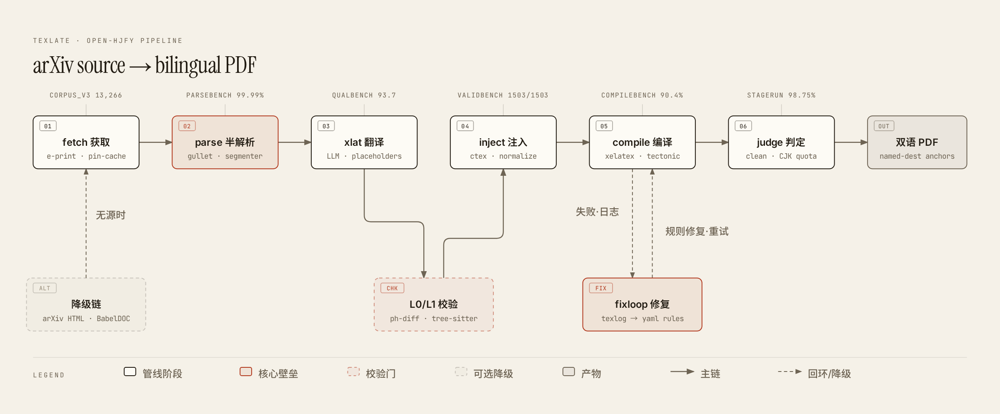
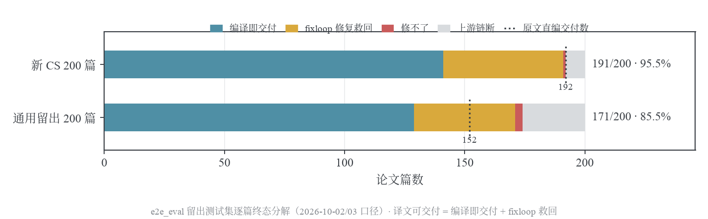
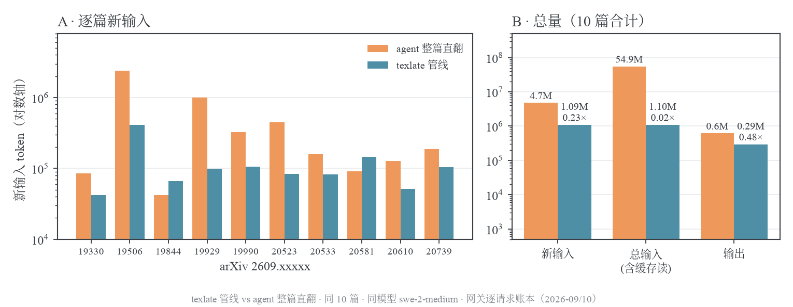
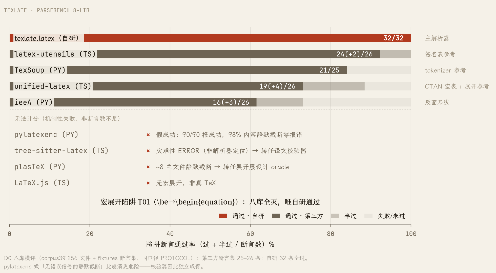

# texlate (open-hjfy)

> 「幻觉翻译」[hjfy.top](https://hjfy.top/) 的开源复现：arXiv LaTeX 源码 → LLM 段落级翻译 → ctex 重编译中文 PDF，双语对照阅读。
>
> _Open-source reimplementation of hjfy.top: fetches arXiv LaTeX sources, translates paragraph-level text with any OpenAI-compatible LLM (BYOK), and recompiles to a bilingual Chinese-English PDF — preserving formulas, references, macros and layout by translating only prose and shielding everything else behind placeholders._

管线：`fetch`(arXiv e-print 钉版缓存) → `parse`(LaTeX 半解析 + 受限宏展开) → `xlat`(LLM 段落翻译，公式/引用/宏全占位符化) → `inject`(ctex 中文环境注入) → `compile`(tectonic/xelatex + fixloop 规则引擎自动修复) → `judge`(编译日志与 CJK 字数核验)。



## 安装

需要 Python 3.12+ 与 [uv](https://docs.astral.sh/uv/)（或 Docker，见下）。

```bash
git clone <repo-url> && cd texlate
uv sync --extra server        # server extra 提供 web/API 形态；纯 CLI 可省略
```

再装一个 TeX 引擎（二选一；`texlate doctor` 可逐项自检环境）：

```bash
uv run texlate tools install-tectonic   # 便携引擎，sha256 钉版（推荐，单文件 ~30MB）
# 或系统包装 TeX Live：apt/pacman 安装 texlive-xetex + texlive-lang-chinese
```

## 快速开始

```bash
uv run texlate run 1706.03762     # mock 端到端：真实编译，但译文是占位假译（链路自检用）
```

**注意：本地 `texlate run` 只有 mock 翻译档**——产出 PDF 的英文段被替换成占位文本，用于零成本验证 fetch→parse→compile 全链。真翻译走 server 形态（下节）。

真翻译（任意 OpenAI 兼容端点 / Anthropic messages 方言均可）：BYOK 配在运行中的 `texlate web` server 上——三 env（另可选 `TEXLATE_DIALECT`）或在 Web Settings 页配置均可：

```bash
export TEXLATE_BASE_URL="https://your-gateway/v1"   # 或自建的本地网关地址
export TEXLATE_API_KEY="sk-..."
export TEXLATE_MODEL="your-model"
uv run texlate web                                  # http://127.0.0.1:8765
```

随后经 SPA 提交 arXiv ID，或用 CLI 瘦客户端向 server 提交任务：

```bash
uv run texlate run 1706.03762 --server http://127.0.0.1:8765   # 真译文 + ctex 重编译 → 双语 PDF
# 按请求覆盖 BYOK：`--model/--api-key/--base-url/--dialect`（x-texlate-* 请求头）
```

三 env 等价于 Web Settings 页配置；本地 `http://127.0.0.1:*` 与 tailnet 主机（`100.64.0.0/10`、`*.ts.net`）放行明文 HTTP，远程端点强制 HTTPS。

## Web 形态

```bash
scripts/build-web.sh            # 构建 SPA → src/texlate/server/static/（需 node/npm）
uv run texlate web              # http://127.0.0.1:8765 —— 提交 arXiv ID → SSE 进度 → 对照阅读器
uv run texlate doctor           # 环境自检：引擎/字体/网关连通/数据目录逐项 ok/warn/fail
```

SPA 是构建产物不入库；未构建时 `texlate web` 只服务 API。BYOK 也可在 Settings 页配置（`TEXLATE_*` env 等价直配）。部署态置 `TEXLATE_MODE=server`（跳过 local-only CSRF 中间件，正式部署请前置反代做 CORS allowlist）。

阅读器分原文、译文、双语对照三视图（arXiv 任务另有导读档）：对照模式两侧滚动同步，双语对位精确到句——悬停或点击任一侧句子，另一侧对应句即时高亮。正文引用标号弹出文献卡：跳至引用目标、反查全篇引用位置、把被引论文一键提交为新的翻译任务——读论文时顺参考文献链直接扩出译文队列。暗色主题对 PDF 逐图元改色而非整图反相，暗色下论文插图不变色。产物下载含 zh.pdf、en.pdf（原文源码本地重编译）、dual.json 对照数据、.bib、zh-src.zip 译后源码包。

任务逐块断点续跑：已译块进缓存，进程重启、机器关机后续跑只补剩余部分；终态分六档，降级产出（部分块回退原文、残余编译警告）以 partial 态标注而非冒称成功。首页上传一个入口四类材料自动分流：本地 LaTeX 工程走同一翻译链、PDF 走 babeldoc 侧车、docx/epub 双语插译、.share.zip 共享包导入。分享包按论文版本、模型、提示词版本、管线版本、术语表等内容寻址，导入方全量校验后本地重编译，不调模型即复现译文。另有 Zotero 7 插件：右键翻译，服务端跑完全链后 zh.pdf 自动挂附件回文献条目。

## Docker

```bash
docker build -t texlate .                                   # 需 BuildKit（COPY --from=外部镜像）
docker run -p 8765:8765 -v texlate-data:/data texlate       # web 形态
docker run --rm texlate fetch 1706.03762                    # 其他子命令同理
```

镜像内置 tectonic + Noto CJK；高成功率编译档（TeX Live xelatex，~4GB）追加步骤见 Dockerfile 头部注释。BabelDOC sidecar（PDF 上传通路）因 AGPL 边界不随镜像分发。

## CLI 一览

| 命令                                                    | 用途                                               |
| ------------------------------------------------------- | -------------------------------------------------- |
| `texlate fetch <id> [--offline]`                        | e-print 获取 + 钉版缓存（`~/.cache/texlate/src/`） |
| `texlate parse <main.tex>`                              | 半解析分块 → chunks.jsonl                          |
| `texlate run <id\|dir>`                                 | 端到端（本地仅 mock 档；真译加 `--server` 提交）   |
| `texlate web`                                           | FastAPI+SSE+SQLite 服务 + SPA                      |
| `texlate export <docx/epub>`                            | 双语插译导出                                       |
| `texlate share pack/unpack`                             | 任务产物社区共享包（sha256 全量回验）              |
| `texlate doctor` / `version` / `tools install-tectonic` | 自检 / 版本 / 引擎安装                             |

离线总闸：`TEXLATE_OFFLINE=1`（等效 `--offline`，取源只查本地缓存）。

## 架构要点

- **LaTeX 是脚本语言**——必须建宏表做受限展开（v2 `gullet/`+`segmenter/` 为唯一解析路径）；按名匹配的保护不可靠。
- **LLM 看不到就不会错**——公式/引用/宏/verbatim 全部占位符化，模型只翻段落级文本；L0 校验器对 src↔zh 做占位符多重集 diff + brace/env/cite-key 相对判定，L1 tree-sitter 校验为可选增强。
- **编译修复是壁垒**——fixloop：日志解析 → taxonomy 分类 → yaml 规则（`compile/fixloop/rules/` 分片）逐条修复重试；`vendor/` 收 off-CTAN 绝版宏包的真件（许可允许者）与净室 stub（禁分发者，见 NOTICE）。
- **译文缓存**——SQLite 按 arXiv ID+ 版本 + 模型指纹命中秒回；`texlate share` 互通。

## 实测指标

评测设施与产品同仓维护：判分器、对照组驱动、分层语料全部收在 `bench/`，下列读数可复算。口径与原始数据见 [metrics 报告](docs/research/methods/metrics-2026-09-19/report.pdf) 与 [对照基线](docs/research/methods/agent-pipeline-baseline-2026-09-28/README.md)。

| 评测器          | 测什么                                                               | 现行读数                                                                             |
| --------------- | -------------------------------------------------------------------- | ------------------------------------------------------------------------------------ |
| `e2e_eval`      | 端到端真译全链：路由→翻译→编译→修复→版面质检的逐篇终态               | 留出测试集：通用 200 篇可交付 85.5%，新 CS 论文 200 篇 95.5%；800 篇放大评测集进行中 |
| `qualbench`     | 翻译质量：ESA 两步评审，评审模型逐段标注错误后打分，与翻译模型不同款 | 1,200 段基线均分 92.9（95% CI [92.4, 93.3]）                                         |
| `parsebench`    | 半解析保真：解析成功率、分块往返逐字节一致、占位符泄漏               | 7,343 个 .tex 文件：解析错误 0、往返逐字节一致 100%、占位符泄漏 0.010%（70/703,498） |
| `validbench`    | L0 校验器对抗：注入破坏须全检出、正确译文不得误报                    | 12,653 篇论文的注入破坏案例：检出 99.99%（漏 64/565,318）、正常文本误判 0.49%        |
| `compilecensus` | 对照分母：原文不翻不修裸编译的天花板                                 | 5,000 篇产出 PDF 79.3%（零警告 57.9%）；失败的 92% 为缺失宏包，其中 91% 已有内置替身 |
| `fixloop`       | 编译修复引擎：日志 → 错误分类 → 规则逐条修复重试                     | 262 条规则、121 类错误；留出测试集修复成功率 93%~98%                                 |



**token 成本**：同模型、同网关、同 10 篇论文的两路对照——管线新输入 1.09M token，为通用 agent 整篇直翻（4.75M）的 23%；含缓存读的总输入仅其 2.0%；占位符逐条保留率 100%（10/10 篇）。逐篇账与输入组成分解见 [token 用量解剖](docs/research/methods/token-economy-2026-10-03/)。



**底座**：语料 13,266 篇分层钉版（46GB），含 3,020 篇开发管线不可见的留出评测集；pytest 10,493 项，干净 clone 全绿。另有 e2e_mock 机械链、soak 失败池浸泡、alignbench 锚点保留等内部回归项。

口径注记：端到端读数取留出测试集（逐篇详账见 `docs/research/methods/`）；早期开发集 v4 口径的 98.5% 已停用。

解析层自研是横评定案：八家第三方 LaTeX 解析库无一通过全部断言（最高 24/26，四家因机制性失败无法计分），`\be` 经宏表展开为 `\begin{equation}` 一类陷阱是分水岭；静默截断不报错，比崩溃更难兜底，校验器因此独立成层。



## 仓库布局

- `src/texlate/` — 产品代码：`arxiv/` 获取层、`latex/` 半解析管线、`xlat/` 翻译编排、`validate/` L0/L1/L2、`compile/` 引擎+fixloop、`server/` Web 后端、`export/`、`cli/` 命令行包
- `web/` — SolidJS+Vite+pdfslick 阅读器（独立 package.json；`npx tsc --noEmit && npx eslint . && npx vitest run`）
- `zotero/` — Zotero 7 插件（TypeScript 瘦客户端，调远端 texlate 服务）
- `tests/` — pytest（corpus/网关/node 依赖用例均有守卫，干净 clone 全绿）
- `docs/` — [`docs/README.md`](docs/README.md) 总索引，六分区：`guide/` 用户文档 + `spec/` 技术规范（实现唯一事实源）+ `decisions/` ADR 决策史 + `dev/` 贡献者文档 + `research/` 调研档案 + `log/` 工程日志；维护规则 [`docs/MAINTENANCE.md`](docs/MAINTENANCE.md)
- `bench/` — 评测 harness（`TIERS.md` 分层契约 + `docs/spec/benchmark.md` 评测器规格 + `docs/spec/bench-trizone.md` 三区账本设计；`py/`=trizone 内核 `kernel/` + 评测 `specs/` + 分析 `verbs/`，统一入口 `bench/py/bench`；`corpus/` 语料清单入库、载荷与产物在 `$TEXLATE_BENCH_ROOT`（缺省 `~/.local/share/texlate-bench`）的 lake/runs/vault 区）
- `tools/` — tracked 诊断/度量脚本（`tools/README.md` 逐件登记）
- `Dockerfile` / `.github/workflows/` — 容器形态与 CI（pre-commit 同源）

## 开发

```bash
uv sync --extra server        # 含 dev group（pytest）
uv run pytest tests/ -q       # 测试
ruff format --check . && ruff check .   # python 门（select=ALL 严格集）
npm ci && npm run format:check          # md/js/yaml/toml 门（pre-commit 同源）
pre-commit install            # 提交钩子：formatter 走 git-format-staged，check 类拦截
```

pre-commit 前置工具：`npm install` + `autocorrect ruff shfmt shellcheck actionlint taplo`（macOS 走 brew；Linux 各发行版包名同名或 `cargo install`/`go install` 等价）。CI 与本地链同源——本地不过 CI 必挂。

## License

Apache-2.0（见 LICENSE）。`compile/fixloop/vendor/files/` 内第三方期刊宏包各随其原许可、`vendor/stubs/` 与 `vendor/shims/` 为本项目净室实现——逐件说明见 NOTICE。

## 致谢

- [hjfy.top](https://hjfy.top/)（吴多益）——产品原型与全部关键设计共识（实现自述：[知乎原文](https://zhuanlan.zhihu.com/p/1905569596599169419)，产品侦察 `docs/research/product/2026-09-14-hjfy-site.md`）
- [ieeA](https://github.com/zcyisiee/ieeA)——参考实现，借鉴模式
