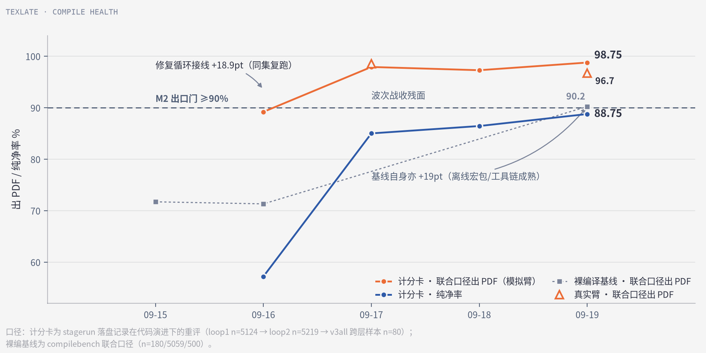
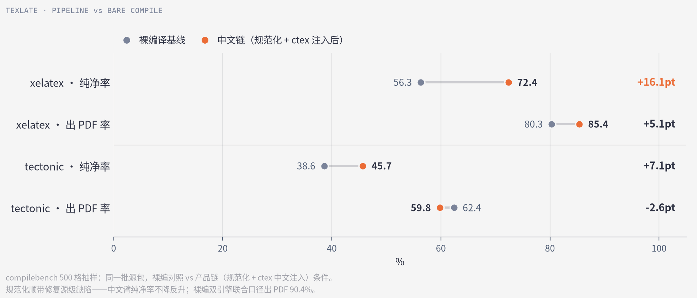
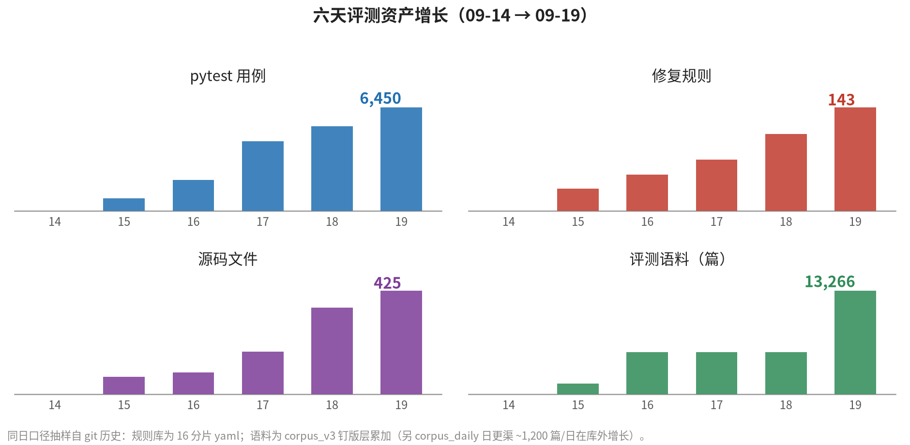

# texlate (open-hjfy)

> 「幻觉翻译」[hjfy.top](https://hjfy.top/) 的开源复现：arXiv LaTeX 源码 → LLM 段落级翻译 → ctex 重编译中文 PDF，双语对照阅读。
>
> _Open-source reimplementation of hjfy.top: fetches arXiv LaTeX sources, translates paragraph-level text with any OpenAI-compatible LLM (BYOK), and recompiles to a bilingual Chinese-English PDF — preserving formulas, references, macros and layout by translating only prose and shielding everything else behind placeholders._

管线：`fetch`(arXiv e-print 钉版缓存) → `parse`(LaTeX 半解析 + 受限宏展开) → `xlat`(LLM 段落翻译，公式/引用/宏全占位符化) → `inject`(ctex 中文环境注入) → `compile`(tectonic/xelatex + fixloop 规则引擎自动修复) → `judge`(编译日志与 CJK 字数核验)。


## 安装

需要 Python 3.12+ 与 [uv](https://docs.astral.sh/uv/)（或 Docker，见下）。

```bash
git clone <repo-url> && cd texlate
uv sync --extra server        # server extra 提供 web/API 形态；纯 CLI 可省略
```

再装一个 TeX 引擎（二选一；`texlate doctor` 可逐项自检环境）：

```bash
uv run texlate tools install-tectonic   # 便携引擎，sha256 钉版（推荐，单文件 ~30MB）
# 或系统包装 TeX Live：apt/pacman 安装 texlive-xetex + texlive-lang-chinese
```

## 快速开始

```bash
uv run texlate run 1706.03762     # mock 端到端：真实编译，但译文是占位假译（链路自检用）
```

**注意：`texlate run` 默认是 mock 翻译臂**——产出 PDF 的英文段被替换成占位文本，用于零成本验证 fetch→parse→compile 全链。真翻译需 BYOK（下节）。

真翻译（任意 OpenAI 兼容端点 / Anthropic messages 方言均可）：

```bash
export TEXLATE_BASE_URL="https://your-gateway/v1"   # 或 http://127.0.0.1:3003 本地网关
export TEXLATE_API_KEY="sk-..."
export TEXLATE_MODEL="your-model"
uv run texlate run 1706.03762                       # 真译文 + ctex 重编译 → 双语 PDF
```

三 env 等价于 Web Settings 页配置；本地 `http://127.0.0.1:*` 与 tailnet 主机（`100.64.0.0/10`、`*.ts.net`）放行明文 HTTP，远程端点强制 HTTPS。

## Web 形态

```bash
scripts/build-web.sh            # 构建 SPA → src/texlate/server/static/（需 node/npm）
uv run texlate web              # http://127.0.0.1:8765 —— 提交 arXiv ID → SSE 进度 → 对照阅读器
uv run texlate doctor           # 环境自检：引擎/字体/网关连通/数据目录逐项 ok/warn/fail
```

SPA 是构建产物不入库；未构建时 `texlate web` 只服务 API。BYOK 也可在 Settings 页配置（`TEXLATE_*` env 等价直配）。部署态置 `TEXLATE_MODE=server`（跳过 local-only CSRF 中间件，正式部署请前置反代做 CORS allowlist）。

## Docker

```bash
docker build -t texlate .                                   # 需 BuildKit（COPY --from=外部镜像）
docker run -p 8765:8765 -v texlate-data:/data texlate       # web 形态
docker run --rm texlate fetch 1706.03762                    # 其他子命令同理
```

镜像内置 tectonic + Noto CJK；高成功率编译档（TeX Live xelatex，~4GB）追加步骤见 Dockerfile 头部注释。BabelDOC sidecar（PDF 上传通路）因 AGPL 边界不随镜像分发。

## CLI 一览

| 命令                                                    | 用途                                               |
| ------------------------------------------------------- | -------------------------------------------------- |
| `texlate fetch <id> [--offline]`                        | e-print 获取 + 钉版缓存（`~/.cache/texlate/src/`） |
| `texlate parse <main.tex>`                              | 半解析分块 → chunks.jsonl                          |
| `texlate run <id\|dir>`                                 | 端到端（mock 臂默认；配 BYOK 即真译）              |
| `texlate web`                                           | FastAPI+SSE+SQLite 服务 + SPA                      |
| `texlate export <docx/epub>`                            | 双语插译导出                                       |
| `texlate share pack/unpack`                             | 任务产物社区共享包（sha256 全量回验）              |
| `texlate doctor` / `version` / `tools install-tectonic` | 自检 / 版本 / 引擎安装                             |

离线总闸：`TEXLATE_OFFLINE=1`（等效 `--offline`，取源只查本地缓存）。

## 架构要点

- **LaTeX 是脚本语言**——必须建宏表做受限展开（v2 `gullet/`+`segmenter/` 为唯一解析路径）；按名匹配的保护不可靠。
- **LLM 看不到就不会错**——公式/引用/宏/verbatim 全部占位符化，模型只翻段落级文本；L0 校验器对 src↔zh 做占位符多重集 diff + brace/env/cite-key 相对判定，L1 tree-sitter 校验为可选增强。
- **编译修复是壁垒**——fixloop：日志解析 → taxonomy 分类 → yaml 规则（`compile/fixloop/rules/` 分片）逐条修复重试；`vendor/` 收 off-CTAN 绝版宏包的真件（许可允许者）与净室 stub（禁分发者，见 NOTICE）。
- **译文缓存**——SQLite 按 arXiv ID+ 版本 + 模型指纹命中秒回；`texlate share` 互通。

## 实测指标

六天开发历程与 2026-09-19 全量画像（口径与全部原始数据：[metrics 报告](docs/research/metrics-2026-09-19/report.pdf)，自包含 `data/` + `refs/`）：

**编译健康度**：联合口径出 PDF 89.17→98.75%（M2 门 ≥90% 过线），真实臂 96.7% 与模拟臂打平；注意裸编译基线自身 +19pt——离线宏包与工具链同步成熟。



**解析壁垒**：D0 八库横评定案自研——宏展开陷阱 T01（`\be→\begin{equation}`）八库全灭，唯自研全过；pylatexenc 式「无错误信号的静默截断」比崩溃更危险，校验器因此独立成臂。


**中文链反而更纯净**：规范化顺带修复源级缺陷，中文臂 xelatex 纯净率 +16.1pt；裸编双引擎联合口径 90.4%。





其余底数：corpus_v3 全量 28,904 文件解析成功率 100%、逐字节一致率 99.99%、占位符泄漏 0.004%（76/1,845,338）；validbench 1,503 对破坏 100% 检出零误报；翻译硬契约 93.7%、LLM 评审均分 94.0；纯净率 88.75% 距 M2 纯净门差 1.25pt。

## 仓库布局

- `src/texlate/` — 产品代码：`arxiv/` 获取层、`latex/` 半解析管线、`xlat/` 翻译编排、`validate/` L0/L1/L2、`compile/` 引擎+fixloop、`server/` Web 后端、`export/`、`cli.py`
- `web/` — SolidJS+Vite+pdfslick 阅读器（独立 package.json；`npx tsc --noEmit && npx eslint . && npx vitest run`）
- `tests/` — pytest（corpus/网关/node 依赖用例均有守卫，干净 clone 全绿）
- `docs/` — [`docs/README.md`](docs/README.md) 总索引：决策史 01–05 + 现行技术规格 06–10 + `research/` 调研档案 + `tools-runbook.md` 工具手册
- `bench/` — 评测 harness（`PROTOCOL.md` 协议；`py/` 评测器 B1–B7 + stagerun 批量驱动；`corpus*/` 语料与 `results/` 产物 gitignored，可经 `bench/py/` 三件套（`build_corpus_v3.py` + `build_hot_layer.py` + `build_corpus_expand.py`）重建）
- `Dockerfile` / `.github/workflows/` — 容器形态与 CI（pre-commit 同源）

## 开发

```bash
uv sync --extra server        # 含 dev group（pytest）
uv run pytest tests/ -q       # 测试
ruff format --check . && ruff check .   # python 门（select=ALL 严格集）
npm ci && npm run format:check          # md/js/yaml/toml 门（pre-commit 同源）
pre-commit install            # 提交钩子：formatter 走 git-format-staged，check 类拦截
```

pre-commit 前置工具：`npm install` + `autocorrect ruff shfmt shellcheck actionlint taplo`（macOS 走 brew；Linux 各发行版包名同名或 `cargo install`/`go install` 等价）。CI 与本地链同源——本地不过 CI 必挂。

## License

Apache-2.0（见 LICENSE）。`compile/fixloop/vendor/files/` 内第三方期刊宏包各随其原许可、`vendor/stubs/` 为本项目净室实现——逐件说明见 NOTICE。

## 致谢

- [hjfy.top](https://hjfy.top/)（吴多益）——产品原型与全部关键设计共识（实现自述：[知乎原文](https://zhuanlan.zhihu.com/p/1905569596599169419)，存档说明 `docs/original.md`）
- [ieeA](https://github.com/zcyisiee/ieeA)——参考实现，借鉴模式
