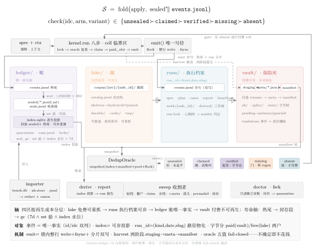

# texlate bench 终态设计：三区账本法（trizone-ledger)v2

> 骨架：wildcard-trizone。v1 经完备性批评（35 条）+ 九个对抗剧本（数十条 major/fatal）复查，无一条推翻骨架本身；所有成立项已逐条吸收进正文——本版与 v1 的差异即批评的答卷。诚实账目（§9）随之更新：内核与移植量上调，止血补丁前置为 Phase 0.5。

> **实现状态（2026-09-22）**：内核件面已按本设计四波落地——`bench/py/kernel/` 25 模块约 15.1k 行，`tests/kernel/` 546 例通过 / 2 例按设计跳过；Wave-D 两轮对抗验证收口（round-2 六车道 94 条发现全数裁决）。收官报告见 `../log/2026-09-22-bench内核wave-d收官.md`。全量 bench 重建（语料注册、历史 import、vault 播种）为下一阶段，开工条件见 §6。

---

## 0. 中心思想（一句话）

**bench = 一本只能追加的事件账 + 一座按字节保真的保险库 + 一片可重建的湖；一切"状态"都是账的投影，一切"产物"都按重建成本分区，代码仓库只留下机制和清单。**

旧世界的两个病根——(a) `records/*.jsonl` 既是日志又是数据库又是跨进程协议，(b) 付费字节（zh-store）和免费字节（work/、archive）混在一个 git checkout 里被同等对待——用这一条思想同时切除：账本回答"发生过什么"，保险库回答"我们花钱买过什么"，湖回答"还能再拉到什么"。9 月 21 日的 sparse-checkout wipe 已证明三者容灾等级天差地别；同日 18:23 errsweep 死于 203/EXEC（ExecStart 指向被扫走的工作树文件）证明**连机制本身也不能住在 checkout 里**。

v2 增补的第二原则：**"永不重复翻译已存 id"不是靠纪律守的，是靠机制守的**——付费判定不从旗标来，从"要构造 gateway client"这个事实来；去重不靠计划期快照，靠首次付费请求前的原子租约。唯一不可违背约束的唯一可靠形态是结构。

---

## 1. 目标布局树

```

$TEXLATE_BENCH_ROOT # 默认 $HOME/.local/share/texlate-bench；必须在 git checkout 之外
├── ledger/ # 第一区：账（小、贵、只追加）
│ ├── events.jsonl # 唯一事实源；全局事件流（flock 串行化，写入契约见 §3.3）
│ ├── runs.jsonl # run 注册表：{run, run_seq, kind, date, slug, spec_hash, ts_start}
│ ├── index.sqlite # 派生索引（WAL）；唯一查询面；格式版本化，可全量重建
│ ├── global-metrics.jsonl # 跨 run 追加文件的家（原 triage metrics.jsonl 等）
│ ├── .lock # ledger 锁文件——建一次，永不 unlink（inode 脚枪对策）
│ └── .ledger-sentinel
├── runs/ # 第二区：一次执行的完整自描述档案（中、可修剪）
│ └── {kind}/ # soak | fixloop | census | xlatbench | errsweep | adhoc | …
│ └── {date}/ # 一律 UTC（时区钉死，见 §7 风险）
│ └── {slug}/ # run 目录 = 身份三元组 (kind,date,slug) 的物化
│ ├── spec.json # 冻结的 bench 定义（Spec v2 序列化）
│ ├── spec_env.json # env_probes 快照（python/tex/bin/引擎版本、网关名——记名不记值）
│ ├── invocations.jsonl # 每次 resume/retry 一条：{flags:{name:value}, spec_hash, code_stamp, ts}
│ ├── events.jsonl # 本 run 事件分片（与 ledger 双写，同临界区）
│ ├── plan.json # 冻结计划：cell 全量枚举 {idc,arm,up,variant,stage,needs,fp_input}
│ ├── cases.jsonl # 评估案例沉淀（CaseSink 平移）
│ ├── .lock # run 级 flock（取代 pgrep-argv 社会契约）
│ ├── heartbeat # mtime 心跳；僵尸收割依据
│ ├── report.md # keep 层：人/agent 读总结（49% 旧 archive run 只剩这个）
│ ├── work/ # 本 run 私有工作树（不跨 run 共享，可删）
│ │ ├── _texmf/ # run 级共享 texmf（引擎自带 flock；可声明 per-paper 冷沙箱）
│ │ └── {safe_id}/ # safe_id = fs 安全形 (idc)
│ │ ├── .lock # run 内同 id 串行锁（same_id_serial 的实现）
│ │ ├── src@ # 只读投影 → lake 载荷（reflink|hardlink|copy 按 fs 分派，禁目录软链）
│ │ ├── zh.{arm}[@{variant}]/ # 每臂独立产物树
│ │ ├── splice.{arm}[@{variant}]/
│ │ ├── xlat-state.{arm}/ # 分块级断点缓存【必需：丢了=重烧配额，prune 豁免】
│ │ ├── state/ # 第三持久类：_xlat_state/_state StateStore 类
│ │ └── build.{up}/
│ └── derived/ # 可重建派生物；derived/ 内 authored=true 件豁免 prune
├── vault/ # 第三区：付费字节（小、不可再生、异地必备份）
│ ├── .vault-sentinel # 只存在于真实挂载卷的文件——防空挂载点写入
│ ├── .lock # vault 写径全局锁（harvest/verify/restore/adopt 全部锁内）
│ ├── .staging/ # harvest 暂存区——与 vault 同卷构造，rename 到位，杜绝跨设备 move
│ ├── zh/{safe_id}/{arm}[@{variant}]/ # 最终译文树（旧 zh-store 归一形）
│ ├── splice/{safe_id}/{arm}[@{variant}]/
│ ├── manifest.jsonl # {idc,arm,variant,assets:{zh,splice},model,source_run,zone,bytes_ok,ts} 追加写
│ ├── meta/{safe_id}.{arm}[@{variant}].json # 提交标记：最后落盘者，verdict=pending→primary|quar|alt
│ └── tombstones 见事件流（不再独立文件——tombstone 是一等事件类型）
└── lake/ # 第四区：免费载荷（大、可再生）
├── corpus/{source}/{safe_id}/ # arxiv html/源/pdf 载荷本体
├── daily/{date}/ids.jsonl # 日更分区（取代 work_daily）
├── durable/ # "贵再生"子区：iclr map.jsonl 类 API 衍生索引、frame.parquet——
│ # 重建以小时计的东西住这里，进 bench backup 集合
├── cache/ # 全局段级翻译缓存（file_cache_key 物化，见 §3.9）
└── tmp/ # 所有 scratch 一律来此（永不写 /tmp——usrquota 教训）

```



架构总览：写径压顶（spec → kernel.run 八步 → `emit()` 双写热尾与 run 分片），四区按再生成本横排（ledger 账 / lake 免费载荷 / runs 执行档案 / vault 付费字节），读通道汇于 DedupOracle——index 投影与 manifest 尾为快照证据，五值裁决 fail-closed，仅 `absent` 经 gate 回授放行付费 cell；importer/exporter/sweep/doctor 垫底为边界与维护件。图源 `assets/trizone-arch.tex`（TikZ，xelatex+fandol 可重编）。

**分区可按卷分裂**：`$TEXLATE_BENCH_ROOT` 内各区允许是指向不同挂载点的软链或独立 env 覆盖（`TEXLATE_VAULT_ROOT` 等）；约束只有两条——vault 与其 .staging 必须同卷（构造保证）,doctor 断言 sentinel 与 st_dev。**runs/work 与 lake 是容量大户，vault/ledger 是耐久大户，分卷是推荐形态不是例外。**

**仓库内只留**:`bench/py/`（全部机制代码）、`bench/corpus/*.jsonl`（清单，git-tracked——manifest 是选择层事实源，必须留在 git 自保）、`bench/fixtures/`、`bench/nominations/`（评审用提名清单，tracked)、`docs/`。**仓库内不再有任何运行时产生物；`bench doctor` 带 stray-dir 检查（repo 内 bench/results/、work\_*/、zh-store 字节重现即报警），兜住 pre-switch worktree 与旧写者。**

目录即身份：`runs/{kind}/{date}/{slug}` 路径本身就是 run_id;`run_seq`（全局单调，runs.jsonl 注册时**在 ledger 锁内** mint——消除 run_id 竞态）只做跨 run 排序与"最新 run"裁决（dossier pick_run 改用它，字典序 bug 随之死）。**spec_hash 不进身份**——spec 微调只换 invocation 记录，不换 run，杀死"改参数=done-set 清零"跑步机。

---

## 2. 运行方式

### 2.1 一个入口

```bash
bench run <spec> --date D --slug S [--param k=v] [--resume] [--max-cost N]
bench plan <spec> ...            # 干跑：报价单 + dedup 覆盖报告（见 §3.6）
bench status [--run R | --id I | --tail]
bench export --legacy --run R --out DIR    # 投影旧视图（按 kind 出全套，见 §5）
bench vault verify | restore | adopt | tombstone
bench ledger import FILE | ingest --external | rebuild-index | tail-ingest
bench lake fetch --manifest M --max-fetch N | prefetch
bench derive --run R             # 重跑 project 阶段（改报告逻辑不重跑格）
bench sweep                      # 收割机（见 §2.4）；任何写命令启动时先自动跑一遍轻量版
bench prune --run R --keep report,events
bench backup | doctor | fsck [--defer-edges]
bench triage|gate|dossier        # 旧分析脚本的子命令化形态
```

`bench run` 内部固定八步：**spec 校验（含 §4 编译期检查）→ freeze_plan（枚举 cell、算 needs、查 done-set、钉 allowed_layers) → 注册 runs.jsonl（锁内 mint run_seq) → 拿 run.lock(LOCK_NB fail-fast) → 逐 cell 执行 → run 终态 harvest+ 对账 → sweep 自清 → 修剪**。

**cell 执行临界区**（替代 v1 的"先锁后查"含混表述，每一行都有攻击对应）:

```
取 cell.lock（阻塞 LOCK_EX）            ← run 内同 id 串行（same_id_serial）
  ├─ 复查：index 查 done∨claimed∨vault verified   ← 计划期快照不够，锁内再看一眼
  │     ├─ done        → 记 status='dedup'（终态，非 RETRIABLE）跳过
  │     ├─ claimed(活) → 记 cat='claimed' 跳过（别人在付，不是错误）
  │     ├─ tombstone/quar → status='reject' cat='regen_gate' 硬停（除非 --regen）
  │     └─ 字节在账外（孤儿）→ adopt 进 vault quarantine + note，不白付
  ├─ 付费格：index 锁内 INSERT claim（租约，见 §3.6）→ 拿 paid_slot
  ├─ emit cell_started → do() → emit cell 终态 → 写 asset 行
  └─ 若该格是本会改字节的末 stage：触发 per-id harvest（§3.5）
```

### 2.2 日常命令样例（覆盖现存全部用途）

| 旧用法                    | 新用法                                                                                               |
| ------------------------- | ---------------------------------------------------------------------------------------------------- |
| `daily-soak.sh`（已退役） | `bench run specs/soak.py --date today`;lake/daily 分区自然形成；soak 是否复活由用户定（§6 Phase 0.5) |
| `wave.py` 波次推进        | `bench run --resume` 复用 run 目录，done-set 自然续跑；run.lock 取代 pgrep                           |
| `triage.py`               | `bench triage`（读 index；**保留非 canon 匹配的审计语义**——见 §3.7)                                  |
| `harvest.py`              | 内核 run 终态步骤 + `bench vault` 动词族                                                             |
| `status_panel.py`         | `bench status`（读 index + heartbeat；自身寄宿迁 `state/status-panel/`)                              |
| `dossier.py`              | `bench dossier --id I`(pick_run 按 run_seq)                                                          |
| `gate_scorecard.py`       | `bench gate`(freeze 信号从 spec_env.json+index 按 run 粒度重建，不再 parse argv)                     |
| `xlatbench.py`            | `bench run xlat --param reps=5`(**rep 进 variant 维**，见 §3.1)                                      |
| errsweep headless         | `bench run errsweep` + runbook 内嵌 `export --legacy` 投影                                           |
| e2e_real/e2e_mock         | bespoke lane 暂留，写 events 即可被账收编；`_xlat_state`/`_state` 迁 work/{id}/state/                |

### 2.3 定时器形态

`$HOME/.local/libexec/texlate/*.sh` 是**安装副本**不是 checkout 软链（防 203/EXEC——9/21 已实证）。副本**必须参数化 ROOT**（读 `TEXLATE_ROOT` env 或按自身路径解析，禁止硬编码仓根绝对路径)。unit 放 `$HOME/.config/systemd/user/`（安装非 link),`EnvironmentFile=-$HOME/.config/texlate/bench.env` 携带 `TEXLATE_BENCH_ROOT` 与 key **名**;`Persistent=false`(enable 时机避开"错过即补火")；加 `OnFailure` 告警或死文件哨兵——journal-only 失败已实证不可见。更新走 `make install-timers` + 强制 `daemon-reload` + `systemctl show -p NeedDaemonReload` 断言；`bench doctor` 含"timer 能 spawn"契约检查。

**切流协议**（任何在飞 unit 的换径统一走）:**disable → drain(`flock -n` 探旧锁无持者 + `bench status` 零在飞 + 无存活 errsweep worktree) → delta-import → 切换 → enable**。机械化为一行 `bench doctor --switch-ok`。

### 2.4 收割机（reaper 有了主人）

`bench sweep`：每个 bench 写命令启动时自动跑轻量版 + 独立 hourly timer（同为 libexec 副本）。职责：stale heartbeat（超阈值）→ 补发 `lost` 终态行 + 回收其 claim 与 paid_slot;pending meta 超时 → promote(abort 则记 tombstone)；孤儿字节（有目录无账）→ adopt 进 quarantine + note;**index DONE ∧ vault 无字节 → harvest-pending 队列告警**（把"done 但未入库"从隐形变一等队列）；永久失败格超龄 → tombstone 化（errors 留账）。

---

## 3. 存储模型

### 3.1 事件（ledger/events.jsonl，唯一事实源）——8 类

```
cell_queued   {run,seq,id,idc,arm,up,variant,stage,needs,fp_input}  # QUEUED 一等公民
cell_started  {run,seq,id,idc,arm,up,variant,stage,claim_id,attempt}
cell          {run,seq,id,idc,arm,up,variant,stage,status,dur_s,metrics,errors,sig,code,fp}
claim         {run,seq,id,idc,arm,variant,op:acquire|release|reap,slot}
asset         {run,seq,id,idc,arm,variant,kind,path,sha,bytes,state}
tombstone     {id,idc,arm,variant,kind,reason,lost_run,ts}          # 丢字节登记=事件
note          {run,seq,id?,text,level}
finished      {run,seq,wall_s,counts,cost_usd}
```

**id 双列恒在**:`id`=写入原拼写，`idc`=canon 规范形（斜杠形，alias 已解）。**canon 是内核写边界的机制不是仪器约定**——内核 append 时自算 `idc=canon_id(id)`（含改名 archive 别名表：q-alg→quant-ph 等 ~45 个实证改名 id；vN 后缀剥离；空格连写/.bak-*/fixture 前缀等非法 id 拒入并 note)；仪器的 key lambda 只定义键形不得定义 identity;`safe_id=idc` 的 fs 编码，单射由构造保证。歧义（322 个数字尾类）进 adjudication 队列人工裁决，**绝不猜**。

**cell 键 = (idc, arm, up, variant, stage)**:variant 是第四维，消化 xlatbench 的 rep、qualbench 的 protocol_v、e2e 的条件维——不再挤占 arm 命名空间。stage 名全局唯一注册（spec 编译期查撞名）；导入的无 stage 行打 `instrument=<文件名推定>` 标签 + `kind=finding` 侧行，不进 cell 流。

**不变式（账务方程）**:plan.json 枚举的 cell 集合 ⊇ 该 run 的 cell_queued 集合，且每个 queued cell 最终恰有一个终态 cell 事件——finished 时校验，不等即报警。这把旧"records 最后一行赢"升级为"计划=账"。

语义沿用（写进 schema 注释固化）：`status` 沿用 DONE={ok,partial,clean,fail,reject,fault,dirty_pdf}、RETRIABLE={skip,error};`errors[0].cat='upstream'` 仍是 triage 豁免/fixloop 过滤门/RETRIABLE 判定三用字段——**改它=改三处语义**;`errors[]` 是 findings 通道（28,826 行 clean-but-errors 实证）;`sig=cat:pay` 不变；`code` 记 instrument-source-hash（见 §3.4);`metrics` 含 usage（网关 token 计数，ChatResult.usage 落账）;`metrics.compile_fp` 仍是新鲜度探针。**可选顶层键白名单**:`queue_wait_s, auth_tripped, attempt`——白名单外键 linter 拒收。metrics 单事件 >4KB 自动 CAS 卸载到 run 目录 derived/blobs，账留 sha（默认开——170KB 行已实证存在）。

**status 分类表升格为逐 stage 必传声明**：每 stage 声明 `status_class={status→terminal|retriable|upstream}`，编译期要求对该 stage 可达状态全集分类；运行时遇未分类状态落 `fault`+note,fail-loud **绝不默认可重试**；付费 stage 的分类表是强制评审点（terminal 错分 retriable=自动重发付费请求）。这杀死"skip∈RETRIABLE 被无限重探"(cache_hit 类）与"dedup 命中被重试"两个洞。

### 3.2 派生索引（index.sqlite)

唯一查询面，纯派生物，格式版本化。表：`events`、`cells(idc,arm,up,variant,stage,last_seq)`、`records`（旧式投影）、`eval_records`、`cases`、`assets`、`claims(idc,arm,variant,run,ts)`、`paid_slots`、`papers(idc, id_raw 别名表)`、`vault_meta`、`runs`。**写入纪律：event 先进 events.jsonl(fsync)，再进 sqlite——sqlite 永远可弃。**重建只在无活 run 时允许（活 run 禁 rebuild:claims 由事件重建，重建窗口内租约是真空的）；增量 tail-ingest 以 (run_seq, seq) 为水位线——**水位记"末个已吞换行的 offset"而非文件 size**。

### 3.3 写入契约（torn-tail / inode / 双写——全钉死）

- **emit() 是唯一写路径**：取 `ledger/.lock`(flock,LOCK_EX)→ open('a')→ **先检末字节非 `\n` 则截到末个换行**(torn tail 自愈）→ 单个 `os.write(整行)` → fsync → close → 放锁。锁先于 open、fd 不跨锁持有、一行一 syscall——即便无锁闯入者（修复脚本、手贱 echo）也只能整行插队、永不撕字节；>8KB 行天然安全。
- **双写钉死**：同一临界区内写 ledger/events.jsonl + runs/.../events.jsonl 分片（成本实测可忽略，不玩"定期 splice"）。ledger 丢→从 run 目录重建；run 目录丢→ledger 有账。
- **`.lock` 文件永生**:locks 下锁文件永不 unlink/rename(flock 认 inode——删目=换锁=双写者复活）；run 目录删/改名操作本身在锁内做；`bench doctor` 禁"修复"锁文件。
- **重写动词**：任何 compact/restore 一律**同锁下原地 truncate+ 重写**（沿用 e2e `_dedup_cases` 已验证先例）,**禁用 os.replace**——在飞 append 方持有旧 inode 会静默丢行。
- **锁序唯一合法方向**:`run.lock → cell.lock → 叶锁(ledger/index/vault)`；叶锁持有期不取任何其他锁；反向路径（如 reconcile 持 index 扫 cell）禁止——reconcile 逐 cell 取锁不嵌套。
- **读侧契约**：所有消费方共享 iter_jsonl 式容错（坏行跳过 + 计数+warn；撕行含付费键进 quarantine 人工修）。
- **跨 run 排序**:`(run_seq, seq)` 全序；import 行无 ts 时按 `(run_meta.started_at → dir mtime → run 名)` 文档化链排序，序敏感键（实证 ~3.9k）出 quarantine 清单，**歧义解向保守侧：付费格偏向 done（护配额）、免费格偏向重跑（护真值）**。

### 3.4 fp（指纹）与 stale 语义

`fp = sha256(spec 源文件内容 + spec.code_deps 声明文件内容, input 分量, cell 级参数)`。

- **code 分量**是仪器源内容 hash,**不是 repo HEAD/dirty-sha**——dirty 不再毒化指纹（dirty 树指纹与 sha 对不上的排查入口改走 spec_env.json)。
- **input 分量**优先取 manifest 已有 `blob_sha256/main_tex_sha256`（不重哈希载荷）；链式引用上游 cell fp（避免 70GB 全树扫描）；未 fetch 的 item plan 期 `fp_input=NULL`、cell_started 补填。
- **params 分量只含 cell 级有效参数**(model/prompt_v/temp/ruleset);selector 旋钮（n/seed/jobs/layer/run)**禁入**——lint 强制。
- **fp 永不进 done 判定**:fp 失配只标 `stale`；重跑须显式 `--recode/--stale-only`;`fp=NULL ≡ fresh`；付费 cell 永不因 fp 自动重跑（重译=§3.6 的 `--allow-regen` 显式门）。
- **plan 期 lint 红利**:"同 idc 跨 arm fp_input 必须一致"自动逮住 mock/real front_matter 不同分布这类实证 bug。

### 3.5 vault 提交序（两阶段，方向钉死）

harvest 物理序：**work 字节 → copy 进 `vault/.staging/{id}.tmp/`（与 vault 同卷构造，跨设备安全）→ fsync → rename 到位 → 最后落 `meta/*.json`(verdict=pending，提交标记）→ emit asset 事件 → cell 终态行**。**目录存在永远不算数；dedup 判据 = meta 可解析 ∧ meta 声明的每个资产（zh∨splice）非空**——splice-only 终态合法（manifest 实有 has_zh:false,has_splice:true 行）。终态行在字节入库后 emit，崩溃不可能产出"账说 done 字节不在"（反向窗由 sweep 的 harvest-pending 队列兜）。

**harvest 时机**:per-id、在该 id 最后一个会改 zh/splice 的 stage 终态后触发（soak=fixloop 或 compile——内核按 spec.stages 的 mutates 声明算）;verdict 由 index 里本 run∪foreign_runs 的 compile/fixloop 终态算，run 终态 reconcile 把 pending 提升 primary/quar/alt,**跨 run pick_final 在 sweep 做**（旧 pick_final 只看单 run 是跨 run 重复烧钱的根因之一）。**last-clean-wins**：后续 run 持 clean 终判收割时覆盖 quarantine 行。

**vault 写径全在 `vault/.lock` 内**(harvest/verify/restore/adopt/regen);manifest 行只许锁内 append;dst 已占则拒 move+ 报警（防 zh/zh 嵌套静默污染）。`bench vault restore <id>` 一等原语（vault→work 硬链农场 + 重写 .xlat-arm 标记，兑现"quarantine 可免费重编译")。

### 3.6 付费保护四件套（唯一硬约束的机制化）

1. **claims 租约（跨 run 去重）**：付费 cell **首次付费请求之前**,index flock 内 `INSERT OR IGNORE INTO claims`;claim_acquired/released/reap 同时是事件（租约入事实源，rebuild 可恢复）;stale claim 由 sweep 按心跳回收。**plan 期快照不够——锁内复查 + 租约才是真互斥**（两并发 run 同 selector 的剧本退化为串行 skip)。
2. **paid_slots（全局并发闸）**:index 租约表，总数 ≤N（默认 4，对齐实测网关容量）；租约随事件回收；跨 run 天然生效——取代进程内 `_SemTranslator`。**auth 熔断入内核政策**：篇内 3×401 abort cell、跨篇 all_failed×2 abort run（移植 stage_xlat.py:607 实证口径）。
3. **付费判定在 client 不在旗标**:bench 内 gateway client 唯一构造点=factory；构造即注册 token 记账员；`translator=='gateway'` 结构化导出付费性，spec 忘标 paid 也在闸内。**run 级预算硬闸**:`--max-cost` 按实测 usage 在 cell 边界间熔断（非计划期估算）；付费 run 缺 `--max-cost` 拒跑；`--detach` 强制带预算旗标。**raw-httpx 旁路不可堵，但可测**：网关侧请求数 vs cell.done 数对账进 doctor，分叉=旁路告警。
4. **三态 dedup + regen 门**：付费格查询域 = vault bytes_ok ∪ index 中付费臂 {ok,partial} ∪ 活 claim。解析三态——**verified→dedup 跳；absent→放行；missing∪quarantine→`reject cat='regen_gate'` 硬停**。"付过费但字节没了"是第三态不是"没付过"——tombstone id 永不自动进待跑集，`--regen` 须同时给 `--sel + --max-cost + --yes`,plan 报价单列 dedup∩selector 交集计数（空转 regen 是响的）。`--rerun/--recode` 对付费格无效力，穿越 regen 门只有 `--allow-regen`。reject/fail/fault/dirty_pdf 归 `attempted-unpaid` 桶——不进 paid-pool 也不进默认 rerun（结构性不可译的格不被 `--regen` 误赎）。

**done-set 求值域**（钉死 scope):needs 边评估域 = **本 run ∪ spec.foreign_runs 显式声明 ∪ vault verified 字节**；门判定 = 账 done ∧ **产物可解析**(work 树在∨可经 index 指针惰性解析∨vault restore)——done-but-bytes-gone → `cat='upstream-lost'` **硬失败非可重试 skip**，且永不自动重排上游（重排上游=绕过付费闸的回路）。`--sel run:X` 选格、`--run` 定写目，缺省写入选中 run 本身；`from_run()` 跨 run 引用带快照语义（plan 时物化进 plan.json),gc 对"被其他 spec plan 引用的 derived"钉住不删 + `bench fsck --defer-edges` 查悬空。

### 3.7 id 归一与审计不对称

写边界一刀切：入账即算 idc，别名表吸收改名 archive;**workdir 只从 idc 派生**。读侧保留不对称——**triage 故意不做 canon 归一**（非 canon 匹配是审计信号，wave-5 漏跑 253 格就是它逮的）,selector DSL 双谓词：`id:` 原始形匹配、`idc:` canon 匹配。这个"故意的别扭"写进注释固化。

### 3.8 verdict×stage done 政策表（quarantine 语义钉死）

| verdict    | xlat                      | compile/fixloop        | dedup                  |
| ---------- | ------------------------- | ---------------------- | ---------------------- |
| primary    | done                      | done                   | 命中                   |
| quarantine | done（永不重译）          | **可重跑**（免费重修） | 命中                   |
| alt        | done（落选副本保留）      | 可重跑                 | 命中                   |
| pending    | 视同无字节（等 reconcile) | —                      | 不命中但锁内复查挡双烧 |
| tombstone  | **regen_gate 硬停**       | —                      | 硬停                   |

### 3.9 全局段级翻译缓存（lake/cache)

`file_cache_key` 全维物化（prompt_ver+base_url+model+lang+glossary+ctx)——跨 run 省配额的最大单笔收益，src/texlate 本来就设计好从未落地。**防毒沿用现有口径**：任务级只复用 done；写缓存前过 verify;partial 毒传播前科意味着缓存写入点只在 cell 终态 ok 后。xlat-state.{arm}/（块级断点态）留 work/ 内且 **prune 豁免**——它是"recode 重跑≈免费"的底材。

### 3.10 存储工程规格：容量、去重与生命周期（存储节省专章）

本节把「存储节省」落成可执行规格：每分区的容量界、每条去重通道的协议、每个字节态的进出生命周期。总原则一句：**规范层唯一常驻、投影层随时可弃、付费字节双副本、账本自我压缩、免费字节 lazy**。

本节关键决定（相对 v2 正文的增量）：(1) lake 永远 lazy——容量帽是水位不是目标，holdout 3,020 格永不 eager;(2) mutating 树物化一律剥 mode 的 copyfile 拷贝，0444 保险丝只存在于 objects/ 与只读投影；(3) vault 凭证键补到五维 (idc,arm,variant,altseq,zone),meta per-copy;(4) run_seq 铸号权回 seqfile 事实源，runs.jsonl 降报表；(5) dedup 神谕 fail-closed——absent→放行只在 sealed index 上签发，manifest 尾部+paid_pool 快照进临界区；(6) zh-store 走字节普查 + 封路径（retired 标记）,stray 检查只收编不删除；(7) pending-mirror 期刊改 WAL 轮换，pending_mirror 指标按字节面未确认数计。

#### 3.10.1 分区容量预算表

| 分区             | 内容                                                  | 现盘实测                                                                     | 容量界                                                                                                                       |
| ---------------- | ----------------------------------------------------- | ---------------------------------------------------------------------------- | ---------------------------------------------------------------------------------------------------------------------------- |
| ledger/          | events 热尾 + 封存段+index.sqlite                     | 393MB/20 万行实证                                                            | 热尾 ≤512MB 硬闸（emit 内联 rotate)；封存 ~0.5-0.9GB/年（zstd -19 实测 30.6×)；总包典型 1.5GB 最坏 ~7GB；五年备份单元 <1.5GB |
| vault/           | zh/splice/state 付费字节+meta+manifest                | zh-store 现盘 3.2G/292 目录；regen ~4.7k 格后 ~50G(+state 层 ~1.5GB/13k 格） | C_w 公式预留 R_vault=25GB 余量；gc 永不自动删付费字节                                                                        |
| runs/{run}/work/ | 本 run 私有工作树                                     | run 驻留 ≈(W+Q+E)·400MB+4GB texmf+N·0.1MB≈17GB                               | C_w=min(60GB, fs_avail−25GB−2GB);0.85 软驱逐 LRU 终态格、0.95 硬停 hydration;_texmf 共享软顶 4GB 超限回落 per-cell 冷沙箱    |
| lake/corpus      | raw 规范层+extracted 投影                             | 2,699/13,312 格在盘 23G;raw ~4.15-4.56MB/格                                  | TEXLATE_LAKE_CAP_GB 默认 100G 水位；raw 全量地板 ~55GB（按 2.7k 均值外推，未物化 87% 偏 expand/dev 新层，可能低估 20-40%)    |
| lake/durable     | frame.parquet/idresolve/iclr map                      | 重建以小时计                                                                 | 进备份集，不随 lake 驱逐                                                                                                     |
| 最小备份集       | ledger+vault+runs keep+durable+.git bundle+$HOME/.texlate | 今日 ~8.5G                                                                   | regen 后 ~55G;corpus payload/work//lake/cache/index.sqlite 明确不备                                                          |

work/ 对称生命周期：终态（含 error/lost/僵尸）收割后默认留 shell（receipt.json+parse.json+xlat-*.jsonl+.xlat-arm.json+.lock,≤~150KB/格）;xlat-state 升格 vault 第三资产类 `vault/state/{safe_id}/{arm}[@{variant}]/`——results[] 逐块付费原文不再随 work/ 死（修订 §3.9「留 work/ 内」口径，prune 豁免对象改为「升格前」)。**唯一删除动词 remove_cell_tree()**:prune/evict/sweep/僵尸收割同一入口，内置「付费树∧无 vault meta→先升格后删」硬闸，升格失败 block+note。secure-then-evict 的提前保字节走与 §3.5 同构两阶段提交：同一 vault.lock 内 copy/link→`.staging/{run_seq}/{sid}.{arm}[@{variant}].pre/`→fsync→立即写 meta{verdict:pending,staged:true}→emit asset——从出生即在 dedup 域可见，消灭「账说已收、字节实亡」的 pre-commit 空窗；被 pending meta 引用的 staging 只许 promote 绝不 discard,needs 解析器把 pending-staged 列为第四再水合源。僵尸判定=heartbeat 15s touch 停 >10min ∧ run.lock LOCK_NB 可获；收割逐格 cell.lock LOCK_NB 复核，锁不可获=活格绝不收。

#### 3.10.2 CAS 与物化协议

`lake/objects/` 两级扇出（aa/bb/sha256,mode 0444):blob/ 存 raw 载荷、file/ 存成员文件；cell 只拥有 ~~4KB 元数据（meta.json/files.txt/mtree.txt)。_*raw.* 定为唯一常驻规范层_*(manifest blob_sha256+IA 坐标双锚）,extracted/ 降级为可驱逐投影——evict farm 释放唯一文件字节、evict payload 走 IA Range-GET 重取。GC 用文件系统原生 refcount(nlink==1+24h grace),reflink 卷兜底 mtree/.casref mark-sweep;file 对象误收无损（可重解）,blob 仅随 payload-evict 收。SourceCache 根直接指入 `lake/corpus/eprint-src/`(沿用 $HOME/.cache/texlate/src 五件套格式，commit 走 src/texlate/arxiv/cache.py:160 staging+rename)，不做双层缓存；幂等 absorb 把遗留 cell CAS 化——**CAS 是优化道不是写径闸**。benchxp-cas 只吸收 fanout/staging 约定与其负结果（runs 文件级 1.1%、记录级 0% 去重）——runs/derived/records 明确不进 CAS。

投影协议二分（红队修订，原「mutating 树保持 copytree」被推翻——copytree 保 mode,0444 顺拷贝链传染全部派生树，而 normalize/inject/xlat 回写/fixloop/引擎覆写全是就地写者，按原规格跑不出一个 zh 臂 cell):**只读投影**(src@、cell extracted）用 hardlink farm,inode 0444 作保险丝；**mutating 树**(zh/splice/build.*/vault harvest 回载物）一律 `shutil.copyfile` 剥 mode 拷贝（umask 0644）或拷后 `chmod -R u+w`——落点 stage_ingest.py:36、stage_parse.py:58、stagerun_lib.py:352、stage_compile.py:153、materialize_entry、vault restore/harvest staging。**明文禁止在 farm 链接上 chmod 补写权**(hardlink 共 inode，会全局熔断对象池保险丝）。内核闸：ctx.workspace(scratch=True) 与 spec `mutates=[...]` 声明的树交付前 probe-write 断言可写，付费 stage 之前 fail-fast；契约测试「任一 mutating 树含非可写文件即拒跑」;doctor/fsck 规则：mutating 树出现 0444 文件=fail-closed，防 0444 zh 经 vault→work 回流再感染。hydration 重解后以 cell 存底 mtree 对账，unpack_ver 记 meta（旧 cell 无版本者标 unpack_ver=legacy)；漂移标 extract-drift+note，不静默换字节。

#### 3.10.3 lazy 三态生命周期

状态机：`skeleton→hydrating→hydrated⇄pinned` + 两个梯级态 `raw_only`(extracted 已逐、raw 在，本地重解零成本）与 `failed`(manifest status=stub/pdf_only/fetch_error ~217 行直接播种，不进待拉集）;`manifested:false` 标记 927 孤儿格并列驱逐首选。state 放 `lake/corpus/catalog.jsonl`（动态目录账，ledger lake_cell 事件的投影，可双路重建）;repo manifest*.jsonl 保持 git-tracked 选择层纯态——水化/驱逐不产生 tracked churn。驱逐=容量帽 + 高低水位+LRU(last_used_at 由 plan 批 touch 与 cell_started 顺手更新）;**永远先逐 extracted 再逐 raw**——但 sw 格（figures_stripped,raw 是重打包文本树，extracted 形态不同）与 stub/pdf_only 格标 `regen_cost=network`，移出梯级一名单。

并发互斥三级：`.locks/{safe_id}.lock`(LOCK_EX 水化/LOCK_SH 投影）、`.items/{item}.lock`（索引重建与批抽互斥）、lease+heart 字段由 sweep 收割僵尸；同格两 run 同拉退化为一拉一等。**raw_only 现解收编为水化器职责**（消费者见 raw_only 只入 fetch 集，同法一拉一等）——红队确认「hardlink 投影 + 共享锁内写」是无检测写穿通道，禁止消费侧共享锁内就地解包；若保留消费侧解，必须 LOCK_SH→复查→升 LOCK_EX→再复查双检，且解包走 staging+rename 原子发布。只读从意图变结构：SourceCache.commit 落位点对五件套 chmod 0444/目录 0555；投影建链断言目标文件无写位；投影时逐文件比对 stat(size,mtime) vs mtree.txt(O_TRUNC 必改 mtime，零成本），不符→suspect→重 sha→quarantine+refetch;lake fsck 周期抽样全量 sha,adopt/gc 路径强制全验（孤儿格不得免验直接 hydrated)。预取双机制：plan 期批量水化保开局 + run 内 lookahead(32 格或 512MB)；湖格也走 claims 租约（锁内 `INSERT OR IGNORE INTO claims(idc,'lake','-','-',run,ts)`)——无付费照样跨 run 互斥。消费侧读谓词：ctx.lake_path()/src@ 投影要求 cell-complete（目录在∧meta 可解析∧meta.n_files 与 extracted 实点一致），不满足走同一租约自水合——**付费格永不投影半途树**。

#### 3.10.4 vault 打包、校验与备份

散树为正典，**否决 tar.zst/squashfs**：实测 97% 字节是 PDF/PNG/MP4 已压缩件，打包换随机读全灭；`bench vault pack` 只留派生用途非正典。存储杠杆=三层硬链接去重：intra-cell（实测 42.9% 重复字节，.fixloop-entry.pdf==主 PDF、zh↔splice 图形件）+cross-cell(index blobs 表反查 sha 直链）+work↔vault(os.link 零拷贝 harvest)。zone 为纯元数据：primary/alt 同空间用 `.{altseq}=source_run` 后缀消歧，promote=meta+manifest 两行零 I/O；仅 quar 保留物理分根。

**凭证键补到五维（红队修订）**:meta 改 per-copy `meta/{idc}.{arm}[@{variant}][.{altseq}].json`，每物理目录有且仅有自己的提交标记（记自己的 zone/verdict/asset_sha);manifest 行加 path/altseq 字段；promote/demote 写 per-altseq 两行，last-row-wins 按 altseq 求值。原四维凭证被推翻：现存 426 个多副本 (id,arm) 键下，每 cell 单 meta+ 无 path 账行使 N-1 个合法付费副本在语义里永远是未提交字节，被自家 sweep/gc 确定性删除。组件级转义恢复单射：arm/variant 内 '.'→%2E、'@'→%40,altseq 限 [A-Za-z0-9-]，解析先吃后缀再切组件。提交序：staging 内建 .files.jsonl（逐件 path/size/sha256)→asset_sha→chmod -R a-w→同卷 rename→fsync→meta 最后落盘→manifest 锁内追加→放锁后 emit。0444 让 restore --link 零拷贝安全，但消费方写模式未全审计前 mutating 消费方默认 --copy(fixloop/replay 原地 patch 会 EACCES 响败——响败好过毒库）。删除谓词硬化：meta-less 目录≠孤儿——先查同 (idc,arm,variant) 兄弟 meta 与 manifest alt 行，age 阈值 + 显式 note 才许 quar；任何删除先查 dedup 域，拒删付费 cell 最后幸存副本；sha 绑定遇同 sha 多目录歧义必须 refuse。heal 按 inode 找齐全部别名统一重链，禁单路径 rename-replace；**撤回「位腐不连坐」**——共享 inode 坏一块全别名同腐，verify 报告按 inode 聚合。

verify 三级节奏：每 sweep stat 级（≤5s)+抽样重哈希 + 日 cron 全量（26G 估 20-40s,inode 去重省 43% I/O)。replica:`rsync -aH` 到异机(-H 延伸去重红利），不带 --delete 保持只增超集；post-commit 即触发 cell 级 mirror,meta.replica.ok 进首火闸；heal 按单文件粒度自愈。备份复用 restic:`$HOME/backups/bench-restic` 本机仓+异机 sftp 仓（`restic copy --copy-chunker-params` 初始化），密码沿用 $HOME/.config/secrets/ 下 restic 密码文件；保留 --keep-daily 14 --keep-weekly 8 --keep-monthly 12+pre-migration/pre-regen 两 pinned 快照。**pending-mirror 改 WAL 轮换（红队修订）**:drain 开始在同锁内 rename 为 `.pending-mirror.{ts}.sending`，新 append 落重建的空 journal,rsync 只发 .sending 快照、exit 0 才 unlink、失败与下个快照合并重发——杀死「截断抹掉飞行中新行」窗口。加 reconcile 闭环：枚举 vault/meta/*.json 与镜像 meta 清单 comm 差集补发（**含 pending→primary 提升行**，否则镜像永久带 pending meta，灾后全部「视同无字节」);pending_mirror 指标改「字节面未确认数」(meta sha 集合差）而非 journal 行数，首火闸才不吃记账伪绿；drain 子进程 setsid+close_fds 防继承 vault/.lock fd 自持锁。restore drill 制度化：周抽 3 格双仓恢复逐 sha256 对 meta、`restic check --read-data-subset 10%` 周跑、双仓 latest ts 对比得 offsite_age，落 ledger note;regen 首火闸加备份门：offsite_age<24h ∧ drill PASS ∧ pending_mirror=0 才放行付费臂。

#### 3.10.5 ledger 规模界

单热尾 + 字节界封存段，不按 run 分文件；追加序（index.line_no）是权威全序，(run_seq,seq) 降为幂等去重键——修正 v2 把它当排序键的表述。**铸号权回事实源（红队修订，原「scanback runs.jsonl 末行 +1」被推翻：便利索引铸号→撞号→UNIQUE 幂等跳过静默吞整 run→claims/done 双盲区→配额双烧零告警）**:run_seq mint=ledger 锁内 `max(ledger/.seq 高水位, 热尾 scanback max run_seq)+1`,seqfile 与 run_registered 同窗 fsync;runs.jsonl 永不作铸号输入降为纯报表。配套：ingest 去重从盲跳改比对——(run_seq,seq) 冲突时比 payload hash，相同才算真重放，不同整 run 进 quarantine+loud error;dedup-skip 计数器进 status/doctor，重放窗口外非零跳过即报警；scanback 遇不可解析行 fail-loud;doctor 断言 `events.max(run_seq)==runs.jsonl.max==seqfile-1`。封存双触发 >256MB 或 30 天；seals.jsonl 哈希链（raw_sha+zst_sha+prev_seal_sha);raw 段在 zst 回验+index 水位过尾 +7 天宽限后删除=单副本政策。index.events 存 slim payload(metrics/errors>4KB 记 sha 卸载 run derived/blobs)，封存段行可 prune;cells/claims/vault_meta 投影永不清。emit_batch 把 cell 终态+asset+claim release 压单 fsync（实测 497→5000 行/s);rebuild=zstdcat 全段 + 热尾回放 26.7k 行/s;**import 必须走批量 ingest 不走逐行 emit**(197k 行 ~7min 的坑）。容量承诺全进 doctor 断言；global-metrics.jsonl 与一切 ledger/*.jsonl 复用同一 emit/seal 写径，不建第二套追加机制。

#### 3.10.6 付费闸（fail-closed 修订）

claim 主互斥=flock 锁文件（`locks/claims/{safe_id}.{arm}[.{variant}].lock` 永不 unlink),claims 表/事件做审计；内核死自动放锁，NB-probe 即权威生死证。租约窗口=首次 gateway 请求前→harvest meta verified;release fate=verified/failed/suspended。付费判定双路径：stage.paid 预取+ctx.gateway() 首请求懒断言；eval 型付费走 spec.dedup_key 键空间。**dedup 神谕改 fail-closed（红队修订，原「index 唯一神谕」被推翻：三种投影缺口全朝「花钱」方向失效，4.6k 决策集裸奔一行 sqlite)**:① absent→放行只在 sealed index 上签发——复查前校验 index 水位≥run 启动时 events+manifest fsync 尾 offset 且 sealed-generation 匹配，不满足落 `cat='index_unsealed'`（可重试终态 + 告警）永不放行；② durable 兜底进临界区——verified 腿直读 vault/manifest.jsonl 尾部（~5k 行，run 启动建 hash 集零成本），历史腿与 plan.json 冻结 paid_pool 快照对拍（missing/verified 与现场 absent 翻转=硬停）,live-claim 走 flock NB probe,index 降 advisory;③ emit 的 sqlite 写失败立即 touch `ledger/.index-dirty`，之后一切复查 fail-closed 直至 rebuild+reseal;④ release(verified) 只在 paid_pool 行可见后发出（meta 落账事务同窗写 vault_meta/paid_pool 行）；⑤ doctor 对账 paid_pool 行数 vs events 付费 ok+manifest bytes_ok 计数，分叉拒跑付费臂。paid_slots=4 slot 锁文件 per-request 取放；401 熔断：篇内 3→release(auth_trip)、跨篇×2→abort,`locks/AUTH_DEAD` 哨兵让所有并发 run 首个 401 后立即 drain(probe_model 前必检）。--max-cost 按实测 usage 在 cell 边界+per-cell μ+2σ 双熔断；付费 run 缺预算旗标拒跑。plan 报价五桶 new/reuse/missing/claimed/attempted,missing≈4,600 格只列 regen 决策单不自动进集。锁序 `run→cell→claim→{slot,ledger/index,vault}` 单向；叶锁内禁取 claim 只许 NB probe。

#### 3.10.7 id 归一（单解 + 钉版）

canon=arXiv 铸发拼写：旧式 `archive/YYMMNNN`（含已改名 archive 原样——q-alg/9703043 即 canon，官方映射 q-alg→math.QA 非 quant-ph,**修正 §3.1 措辞**)、新式裸 `YYMM.NNNNN`;`cat--id` 降格纯 fs 编码 safe_id，永不进 id 字段。canon_id 升级纯函数 parser(bench/py/idnorm.py ~200 行）:total/pure/idempotent,Ok|Ambig|Invalid 三态；多 token 按空白切分。papers registry=corpus manifests∪ledger distinct∪vault manifest∪id_overrides(tracked)∪idresolve(durable)；裸 `\d{7}` 只经它解析：|cats|=0 Invalid、≥2 Ambig 绝不猜；**|cats|=1 还须该尾有 tracked-manifest 或 idresolve(arXiv 核实）来源才 Ok，否则 Ambig 进裁决队列**——本地单猫≠全局无歧义，错猫=译错论文烧配额。**idc 只解一次（红队修订，原「emit 重算」被推翻：emit 重算依赖可变外部状态，与 plan 冻结 idc 成双事实源，拒写落在付费终态事件上）**:plan/freeze 期解析后 idc 当数据随 cell 上下文携带，emit 对 run 自有事件只校验「idc 在且形合法」；发现重算≠冻结值按冻结值落账+note level:'canon_drift'(fail-loud 非丢行）。拒写闸只保留 items/--ids/--sel plan 期与 import/ingest--external 边界。resolver_rev 钉版：tail7→cats 快照+id_overrides.jsonl sha256 写进 plan.json/spec_env,run 与 --resume 复用同一快照，新 overrides 只对新 plan 生效。裁决落地：`bench/corpus/id_overrides.jsonl`（人写 tracked)+`lake/durable/idresolve.jsonl`(API 衍生）+`bench ids adjudicate|resolve|override`;544 歧义尾 +3 垃圾行 +4 .bak-mock 行成种子文件；import 分类器 Ok 进账、其余进 ledger/quarantine.jsonl。override 追加走 flock+ 整行 write，文件 sha 进 resolver_rev。IA tar 成员名 `arXiv-cond-mat9601002v1.gz` 是第三编码——fetch 边界自配 parser。读侧永不归一清单不变：events.id、records 投影、triage 与 id：谓词、import id_raw——审计不对称刻意保留。

#### 3.10.8 重建编排

IA 通道密度分派：item 内 wanted≥12 走整 tar `.part` 下载 + 单遍流扫（命中即落 cell、offset 索引副产、扫完删 tar),<12 走 view_archive per-member（实证按名直取）——70/79 密件覆盖 8,465/8,568 成员，~21GB 下载替代 15h 串行；9,351 ia 缺失格只须传 ~6.35GB（先 tar 头步走法 ~128k 个 512B Range-GET 重建 .items/{item}.jsonl 偏移索引，再按 wanted_bytes/item_size≥0.4 阈值二选一）。**IA 层永不重建 offset 索引**（探测即抓取）;durable members/_.jsonl 只为 TIGER 保留。TIGER 二级降级：先 probe HF 松散成员 `{yymm}/{id}.{gz,pdf}`(oid 校验），未覆盖回整 tar 流扫；HF tree API 快照重建 tiger-files.csv。e-band 无 item 格（~110 个 21xx+ id）路由 scholarweave footer/rg 重水化（47 次 Range-GET 重建 footers+id 列扫描，行组传输量 5-15G 待实测），记 figures_stripped+drift note；无 channel 的 254 格挂 eprint ~85/日慢通道队尾，归不了队标 `failed reason=no_bulk_route`。**物化真原子化（红队修订）**：整格在 `lake/tmp/rebuild/{run_seq}/{safe_id}.stage/` 构好（raw→unpack→meta atomic_write)→整目录 rename() 到位；done-check 退化为「dest 目录存在∧meta 可解析」，已占 dest 拒 rename 先者胜——撕 meta/半 extracted 读者窗整体消失。staging 按 run_seq 隔离，verify 失败只删自己创建的文件。absent 语义硬化：view_archive 200+body 先验魔数（gzip 1f8b/%PDF/tar ustar)，不匹配按 upstream-retriable；仅「200+0 字节」算 member_absent——防瞬断把真成员打成 absent 挤占 eprint 日 85 预算。限速：per-host token bucket(IA 聚合 rps 1.5/HF 2)+Retry-After;>30min 一律 --detach setsid+run.log。相位：A 索引重建（先 2 item 试温再放量）→B item 分数批拉（v1/v2+core 最先，booster+expand 次之，dev__ 再次）→C 孤儿 adopt(adopt 前 canon 归一 + 抽样核字节，确认非毒格再入 catalog)→D eprint 慢通道；重建窗口开 --harvest-all 把已碰 item 全成员跨层一次抽齐。

#### 3.10.9 绿地取舍清单

e2e 双件一律 spec 化（mock→variant、real→paid+dedup_key)，不养第二类写者；demo.sh:66 改指 bench run。repo 数据面零容忍：results+archive 在 export --legacy 对拍绿后迁 `$ROOT/legacy/`;stray-dir 检查改「报告 + 收编」（走 vault adopt→quarantine)**绝不删除**——删除须对普查快照显式 diff。zh-store 走字节普查非 manifest 导入：5,481 行进账为 asset/tombstone 事件，~4,991 有行无字节=regen 决策单。**封字节路径（红队修订）**：普查后 bench/zh-store payload 层整 rename 为 `zh-store.retired/`+MIGRATED 标记，迟到 harvest ENOENT 响败；窗口期重现条目一律 adopt 非删。**drain 门（红队修订）**：普查前与 .kernel-active 哨兵前各跑 `bench doctor --switch-ok`(flock -n 探旧锁+heartbeat 扫描+pgrep 扫脱管 lane 工作目录/PPID=1 普查），有在飞写者则等/杀；~10 行补丁提前 P0 落，检查点放 cell 循环内每次付费请求前查 PAUSE/.kernel-active——在飞驱动下一格即停，损失 ≤1 格；普查后对 zh-store 字节与 manifest 追加各做 delta-pass；锁桥补双向：旧驱动付费 stage 前取新 ledger/cell flock。跨卷修正：「跨卷则 hardlink 农场」不成立——EXDEV 必败，跨卷只能 reflink/copy+verify。.gitignore/formatter/lint 排除行永久保留（纵深防御）;frame 排进下个 IA bulk 批落 lake/durable/frame/;9 个 records 合成测试文件走 ~80 行 events→records 投影适配器；benches.md 名册火化由 spec docstring+bench spec list 生成表取代。

#### 3.10.10 开放问题

- IA 对 ~128k 个 512B Range-GET 的限速未实证（按 8 并发/100ms RTT 估 ~30min)；被限速则退低并发或流式整包，Phase A 试温先行。
- scholarweave 行组放大未实测：wanted 1,065 格散布行组未知，行组内非 wanted 字节被迫传输；远超 30G 则改 LazyFrame 列投影。
- lake 帽 100G 与全量回暖 ~120G 冲突：本方案取「湖永远 lazy」(holdout 不拉）;Phase B 前用户可裁决改 ~180G。
- hydration ~50-100ms/篇未实测；冷 cell 大批命中叠加分钟级预热，靠 plan 期预水化兜。
- 再提取确定性依赖 unpack 管线版本冻结：unpack_ver 尚未落地，过滤/排序规则改动会使 hydrate 产物与存底 mtree 不符。
- 927 孤儿格疑似 corpus_daily 残留：adopt 登记前的 canon+ 抽样核验未跑。
- restore --link 消费方写模式审计未完；cross-cell 反查表只增不剪，tombstone 后悬空 sha 待 doctor reconciliation。
- Mac 容量硬伤：vault-mirror ~55G+restic ~55G≈110G > 89Gi 可用——镜像/restic 迁出一个，或镜像道降级为 regen 期专用临时通道；L2 真异地空缺（同屋异机离线时 offsite_age 常态 >24h),HF dataset 冷层无账号实证。
- index.events prune 后深史只能流式扫 zst；段级 .idx(idc→off）稀疏索引未实现；5 年 cells ~11M 行/index ~5GB 的分代方案未设计。
- xlat-state 升格使 vault +~1.5GB:R_vault=25GB 是否够盖 state 层+zh/splice 增长待复核；secure-then-evict 收敛依赖 evictor 跟得上 1200 格/日 churn 未实测。
- view_archive 覆盖率未全验（老 item/.pdf 成员/带点 cat);TIGER loose-dir 覆盖枚举未完（tree API 分页疑似同页）;vN 剥离后 version 归宿（variant 维 vs metrics）未定；`cat.SUBJ/YYMMNNN` 带点旧式零实例，剥 SUBJ 假设未实战验证。

---

## 4. 新 bench 作者形态（Authoring Spec v2)

一个 bench = 一个 `.py` 文件导出 `spec` 对象。**stages 是一等字段**——旗舰用例 soak=单 run 内五 stage 串行（ingest→parse→xlat→compile→fixloop)，不再是"五 run/日"的账务碎裂：

```python
spec = Spec(
    kind="soak",
    params={"ruleset": Param(default="hard18"), "n": Param(int, required=True)},
    stages=[
        Stage("ingest", fn=do_ingest),
        Stage("parse",  fn=do_parse,  needs=[("ingest", accept={"ok"})]),
        Stage("xlat",   fn=do_xlat,   needs=[("parse", accept={"ok"})],
              paid=True, executor="async-owned", cost_hook=gateway_cost),
        Stage("compile",fn=do_compile,needs=[("xlat", accept={"ok","partial"})],
              mutates=["zh","splice"]),
        Stage("fixloop",fn=do_fix,    needs=[("compile", accept={"ok"})],
              on={"compile": {"fail","dirty_pdf"}}, mutates=["zh","splice"]),
    ],
    items=items,                    # yield (id, arm, up, variant)
    freeze_plan=True,               # plan.json 存在则逐字复用 cell 集；--replan 显式重枚举
    executor="thread",              # stage 级可覆盖：thread | process | async-owned
    env_probes=["python","xelatex","tectonic","gateway_name"],
    code_deps=["src/texlate/xlat"], # fp code 分量的哈希对象
    foreign_runs=[],                # done-set 外部来源，显式声明
    allowed_layers=["core","daily"],# holdout/eval_only 层须 spec.eval=True 才进 items
    lake=True,                      # 声明需要 lake 语料（触发 admission control）
    same_id_serial=True,            # 同 idc 的 arm 间串行
)
```

**编译期检查**（spec 加载即跑，杀死静默歧义）：每 stage `status_class` 对可达状态全集分类；paid stage 的 dedup_key 必传（资产型=(idc,arm,variant)，评测型自声明如 (model,rep,sample)——eval cell 跨 run 去重靠它）;arm+variant 组合在 items 内唯一；params schema 有类型/choices 校验（杀死 stringly params);status 映射表 linter 禁把伪终态映进 RETRIABLE。

**ctx 面**（作者不碰锁/账/fp/harvest):`ctx.upstream_rec(stage)` 末条胜行投影、`ctx.src_path()`（只读投影）、`ctx.workspace(scratch=True)`（可写物化——compile 类的供给面）、`ctx.paper_dir()`（跨臂共享兄弟位，_texmf 语义）、`ctx.lake_path(id)`、`ctx.claim()`/`ctx.paid_slot()`、`ctx.emit(row)/emit_note()`、`ctx.gateway()`（唯一付费通道，内置熔断）。**needs 边是三元组 (stage, accept={...}) 行谓词**，上游口径用上游 stage 自己声明的 accept——通用 DONE 词表只做展示层。

**executor 契约**:`thread`（默认）、`process`(pickle 边界=路径）、`async-owned`——仪器自管事件循环，内核保证：contextvar(req_timing 等）传播、同 idc 串行、paid_slot 与首次请求绑定、ctx.gateway 包装层内建两条 auth 熔断。xlat 是首个 async-owned 用户，契约按它的实证需求写，不是空头支票。

**诚实成本**：新 spec ≈40 行接线；**移植存量驱动 ≈70-80% 逻辑平移**（抽样器/报告器/分类表全存活），内核只收编 argparse/done-set/executor/run_meta/resume ≈150-200 行/驱动。审计面（status 映射+done 定义 + 分母守恒对拍）是新增工作量不是减量——按周排期不按驱动数排期。

---

## 5. 消费方迁移（全量 disposition 表）

**原则：没有"免费兼容"，只有 `export --legacy` 投影缓冲 + 每件签出的 checklist。**投影按 kind 出全套——soak 类：`records/{stage}.jsonl + cases.jsonl + run_meta.json + work/{wid}/{src,zh,splice}`（硬链农场），目录名保 `soak-{date}[-slug]` 兼容 runbook glob;e2e 类：扁形五件套 `records.jsonl+results.json+matrix.md+summary.md+run_meta.json`。

| 消费方                                                                                                                                                | 处置                                                                                                                                                                                                                                                                                                                    | 时点        |
| ----------------------------------------------------------------------------------------------------------------------------------------------------- | ----------------------------------------------------------------------------------------------------------------------------------------------------------------------------------------------------------------------------------------------------------------------------------------------------------------------- | ----------- |
| **errsweep.service/.timer**（唯一存活 unit；今日已实证 203/EXEC 死亡）                                                                                | Phase 0 先**复活**（libexec 副本+ROOT 参数化）;Phase 3 迁移：--add-dir 加 $BENCH_ROOT 读+derived 写授权、runbook §A 全段重写、errsweep.sh 内联 prompt、scheduled_tasks.json **同一 commit**;runbook 加版本戳、launcher 校验 worktree 版本不符即 fail-closed;web 侧输入面（texlate.db 签名榜）不动；`cp -a` 副本纪律保留 | P0+P3       |
| **errsweep/{2026-09-19,20} 未合并分支**                                                                                                               | Phase 2 动 stage_fixloop 前必须 merge/rebase/废弃三选一——否则复活死码                                                                                                                                                                                                                                                   | P2 前置     |
| **cron 3da82458**(21:37 读 work_daily——已打空）                                                                                                       | 改指 lake/daily 或退役                                                                                                                                                                                                                                                                                                  | **P0 当天** |
| triage/dossier/gate/status_panel/wave/rundiff                                                                                                         | `bench` 子命令化；triage 保非 canon 语义；dossier pick_run→run_seq;gate 冻结信号经 index 按 run 粒度重建；status_panel 寄宿 `state/status-panel/`;wave 由 resume+lock 取代                                                                                                                                              | P4          |
| harvest/旧 prune 谓词                                                                                                                                 | 内核接管；`bench vault` 动词族                                                                                                                                                                                                                                                                                          | P3          |
| e2e_real/e2e_mock（扁形五件套+sample_ids 续跑钉样+_xlat_state/_state)                                                                                 | bespoke lane 保留写 events;run_meta.sample_ids→spec 字段映射；StateStore→work/{id}/state/                                                                                                                                                                                                                               | P4          |
| xlatbench/qualbench（评测型付费，dedup_key 非资产形）                                                                                                 | spec + 自声明 dedup_key；预算闸照套                                                                                                                                                                                                                                                                                     | P4          |
| compilebench_v3/parsebench/validbench/wrapfloat/gullet/fixture_assert/translators_bench                                                               | spec 重写队列，**逐驱动审计清单**(status 映射+done 定义 + 分母守恒 vs 归档基线）                                                                                                                                                                                                                                        | P4 按频率   |
| alignbench/quality_proxies/l2_attr_probe（读别 run 产物/xlat-state/双布局嗅探）                                                                       | 改走 index/`ctx.upstream_rec`/`bench derive`                                                                                                                                                                                                                                                                            | P4          |
| corpus builders ×7（同根写 manifest+payload)                                                                                                          | 加 `--manifest-root/--payload-root`;manifest 留 repo tracked、payload 落 lake；加 git-check 钩断言 manifest*.jsonl 保持 tracked                                                                                                                                                                                         | P4          |
| iclr_fetch/iclr_map/iclr_pdf*/gwpilot/task_ping(work_iclr、map.jsonl 等贵再生件）                                                                     | spec/子命令化；贵再生产物迁 `lake/durable/`(9h API 工已丢过一次，不再放可删层）                                                                                                                                                                                                                                         | P4          |
| bench/ts ×6(node harness 钉死 BENCH/corpus+results)                                                                                                   | 路径常量换根                                                                                                                                                                                                                                                                                                            | P4          |
| bench/frame(frame.parquet 3.1M 行派生）                                                                                                               | `lake/durable/`（重建不便宜，进备份）                                                                                                                                                                                                                                                                                   | P2          |
| nominations(bench/corpus/nominations→bench/nominations)                                                                                               | 路径搬家 + 引用更新                                                                                                                                                                                                                                                                                                     | P4          |
| **文档契约面**:AGENTS.md（全 agent 首读）、RETENTION/TIERS/runbook_loop/benches/automation/tools-runbook/spec×2/zh-store README/corpus MANIFEST/seams | 与切换同 commit;doc-contract 测试断言 runbook 点名的每条路径/命令存在                                                                                                                                                                                                                                                   | P3/P4       |
| **工具链 excludes**(.gitignore/.prettierignore/markdownlint-cli2/eslint/pre-commit/ruff)+ demo.sh + MEMORY 条                                         | 同 commit 更新                                                                                                                                                                                                                                                                                                          | P3          |
| **测试面 ~15 文件**：合成 records 树的 9 文件、test_fuzz_scorecard 变异回放、conftest corpus 根                                                       | records-projection fixture 适配器（~80 行，events→tmp records/ 树）保合成面；fuzz skip-guard 改"无账即 fail";conftest 换双根                                                                                                                                                                                            | P3          |
| zh-store 产品读侧                                                                                                                                     | vault manifest 同构+bytes_ok 可验证；**产品侧（TEXLATE_DATA_DIR tasks+texlate.db、段缓存、server translator）去重声明界外**——"唯一 factory 即唯一记账员"只 bench 内成立，web 面留后续工作                                                                                                                               | 界外声明    |
| bench.db 分析者                                                                                                                                       | 全量 import 进新 ledger(脱敏）；旧库封存                                                                                                                                                                                                                                                                                | P1          |
| 外部写者（zhstore-import 类）                                                                                                                         | `bench ledger ingest --external`:run='external'、seq 账本分配、最低公共面契约                                                                                                                                                                                                                                           | P1          |
| 15 天 soak 计划                                                                                                                                       | 已退役不自动复活；复活=`bench run soak`+新 unit                                                                                                                                                                                                                                                                         | 用户决定    |
| **死件清单**(report/ 6 件、_benchkit、三死导出 ≈-4,400 LOC)                                                                                           | Phase 4 显式携带执行清单，不许漂                                                                                                                                                                                                                                                                                        | P4          |

**语料根决议（双根，不偷懒）**:manifest=选择层（repo tracked),payload=数据层（lake)。benchlib 加 `TEXLATE_CORPUS_DATA` 第二 env——未设时 payload=root（今日行为，零破坏），设了则 payload 走 lake;26 个同根调用点 Phase 4 逐个迁，builder 改双目标写。**禁止"整体换根"偷懒路径**——那会把 manifest 带出 git 跟踪，恰好拆掉"tracked=git 自备份"这条 wipe 幸存理由。

---

## 6. 分步落地路径（每步独立可绿，均带回退点）

**Phase 0 — 止血、隔离与备份（当天，纯防护）**

1. **肇事确认 + 进程普查**：确认 sparse-checkout 会话已停；`pgrep/lslocks`+nohup 日志+tmp/lane-* 登记全部在飞旧批（setsid 脱管批是常态）。
2. **tracked 账先落盘**:zh-store manifest.jsonl 现有 **+110 行未 commit 恢复写**——先 commit 或拷出（tracked 账的 delta 也是可失物）;.git 修复核验（extensions.worktreeconfig 残留）。
3. **异地两份**:`tmp/benchxp-sqlite/bench.db`(457MB 唯一全账副本，在 quota 敏感的 tmp/ 里——**第一优先**)、zh-store 整树、bench/corpus 清单、tmp/lane-flip{14,15}、archive-2026-09-20 → `$BENCH_ROOT` 前身 + 异机。**corpus payload 不备**（可再生，备清单+refetch runbook;lake/durable 除外）。
4. **cron 3da82458** 退役/改签；**errsweep 复活**(libexec 副本+ROOT env)。
5. **PAUSE 文件机制**:`$ROOT/PAUSE` 由 bench CLI 与 timer 脚本共同首检——手术日 touch 即全线静默，比赌 timer 间隙可靠。
   回退点：什么都没动。绿判据：异地两份+manifest↔字节对账报告+errsweep 一轮绿。

**Phase 0.5 — 止血小包（条件触发，~100 行独立 commit，与本方案存废无关）**
若用户在 promo 窗（2026-10-16 到期）内恢复**任何**付费跑批（旧世界或新世界），先落：stage_xlat 读 manifest/lost.ids 的译前去重闸（~20 行）、prune 的 real-臂字节保护（结构性——忘 harvest 永远烧不到）、harvest-before-prune 一行、RecLog flock（~8 行，取代 pgrep 契约）、argv 脱敏（~8 行）、eprint reject→skip（~2 行）、date UTC 钉。**这组补丁把"重构期=失血期"变成伪命题**；不恢复付费跑批则整包可省。

**Phase 1 — ledger 落账（1~2 天）**
8 类事件+runs.jsonl+index 全表+emit() 写契约+tail-ingest+`export --legacy`+import(bench.db ∪ 工作树 jsonl 全扫 ∪ zh-store manifest ∪ archive 100 run/245 jsonl——**按行内容 hash 幂等去重**;import 管道内置 secrets redact,**保留原值 sha256 供核验**)。序敏感键出 quarantine 清单按 §3.3 保守侧解。**不动任何在跑的东西。**
绿判据：197K+ 行导入后 `export --legacy` 与 bench.db 对拍一致（脱敏感知对拍器）;index 全量重建 ≤60s（原型实测 7.4s)。回退点：旁路删除即退。

**Phase 2 — vault 成库（1 天）**
**活字节普查**（不是 manifest 导入）：扫一切字节承载目录（zh-store 含 _quarantine/*alt、tmp/lane-*、tmp/replay-_、errsweep worktree work/、残留 work/{id})，三态对账——有字节无行→quarantine 导入算 sha；有行无字节→tombstone 事件；有目录缺资产→按 meta 声明逐件核。meta 补写（verdict 按 manifest+run 事件重放，承认旧 provenance.json 是弱提交前身——写于 move 后但无 pending/reconcile 态）。**在飞恢复写协调**：普查先冻结快照、再 delta-pass 收普查后落盘的 recovered-* 行；provenance 进 meta。字节归位 vault（variant-aware 路径）+claims 表+`vault verify`+sentinel+`bench backup` 进日 cron 起转。
绿判据：每行 manifest↔每字节双向对账平；tombstone 清单（~4,991 量级）作为**用户 regen 决策单**交付。回退点：原树保留到 verify 全绿。

**Phase 3 — 内核与首个 run(2~3 天）**
bench run 八步 + 锁序+claims/slots+auth 熔断+needs 域+executor(thread 先行，async-owned 随 xlat spec)+PAUSE+**锁桥**（过渡期 bench run 同时取旧 soak.lock 命名空间，旧 shim 持新 ledger 锁——双世界共一互斥）+errsweep 投影先行→原生。**第一个真实 run 用无付费 spec(compile/census 类）**验全套机械。
**首火闸**（无人值守付费的机器门）:`bench plan` 输出 dedup 覆盖报告（ledger 付费 ok id 缺 vault 字节/tombstone 的计数）+index sealed 标记+`vault verify`<24h 新鲜度——任一不满足，付费臂拒跑。
绿判据：errsweep 一轮全程新路径 + 账务方程校验 + 老 runbook 读投影无感。回退点：旧 .py 全部原位保留。

**Phase 4 — 作者面与收尾（滚动）**
Spec v2 按使用频率重写（fixloop→census→xlatbench→…)，每驱动带审计清单 + 分母守恒对拍；`bench status/gate/dossier/triage` 子命令化；消费方 checklist 逐件签出后 compat/投影才退役；`lake/cache` 全局段缓存；死件清单执行；文档 + 工具链+scheduled_tasks.json 同 commit。**回退点：每个 spec 独立重写，旧驱动保留到等价性对拍过一次真 run。**

---

## 7. 不做清单

1. **不做公共缓存 registry/多机共享账本**——MT1 已否；跨机只到"备份"层。
2. **不把 sqlite 当事实源**——永远可弃；绕过 jsonl 直写 sqlite 即破窗。
3. **不做自动 regen**——tombstone 给清单、`--regen` 给开关，赎不赎是人的配额算术。
4. **不搞分布式锁/外部队列**——flock+sqlite claims 覆盖全部并发面；**单宿主约束写死**,$BENCH_ROOT 落 NFS/共享挂载=doctor 拒跑（flock 语义 + 时钟漂移不支持）。
5. **不自动迁移历史 work/ 树**——旧树只读档案态，考古走 `export --legacy`。
6. **不把 secrets 放进任何持久面**——spec_env/invocations 记名不记值；`bench ledger lint --secrets` 进 CI；注意 Phase 0 备份会复制含明文 key 的 bench.db——**异地副本同密级对待**。
7. **不做 Electron/前端面板**。
8. **不收编产品侧去重**——vault=bench 收割域；web 面（texlate.db、段缓存、server translator）界外声明。
9. **不搞逐 cell DAG overlap**——xlat paid_slot=4 与 ~119s 排队是实测瓶颈，overlap 只省便宜的尾巴。
10. **不留"半合法"写者通道**——emit() 唯一写径+bespoke lane 也走它；任何直写 events 的脚本等于撕账。

---

## 8. 风险对策表

| #   | 攻击                                          | 对策落点                                                                                                                               |
| --- | --------------------------------------------- | -------------------------------------------------------------------------------------------------------------------------------------- |
| R1  | bench.db+records 含明文 key;import 扩散       | import 管道 redact+sha 核验；spec_env/invocations 记名；lint --secrets 进 CI;**备份副本同密级**；轮换属用户操作                        |
| R2  | "promo 剩 ~25 天应先翻译不是重构"             | **Phase 0.5 止血小包独立于本方案**；机制 Phase 0-2 共 ~4 天才碰机制；付费路径复活优先级高于内核纯度；配额算术不划算则 Phase 4 整体推迟 |
| R3  | 并发 wipe 复发                                | 三区在 checkout 外+P0 异地备份+libexec 副本化+stray-dir doctor                                                                         |
| R4  | harvest 中途死=字节无标记被误判               | meta.json 提交标记+staging 同卷 rename+pending→reconcile+harvest-pending 队列+verify<24h 首火闸                                        |
| R5  | 跨设备 harvest copy+ 删源                     | .staging 在 vault 内构造保证同卷；sentinel 防空挂载点写入                                                                              |
| R6  | 跨 run 双烧（快照 plan 看漏在飞格）           | claims 租约 + 锁内复查 + 并发退化串行 skip;plan 打印 dedup 交集计数                                                                    |
| R7  | 僵尸 run 占 claim 骗 done-set                 | sweep 收割：heartbeat 死→lost 事件+claim/slot 回收；孤儿字节 adopt                                                                     |
| R8  | dirty-sha 进 fp 炸 done-set                   | fp=instrument 源 hash;fp 只标 stale 不进 done;selector 旋钮禁入 params                                                                 |
| R9  | lake fetch 风暴写爆盘                         | --max-fetch/--refetch 显式+per-run pin+plan 期 disk watermark 预检+lake 驱逐动词（清 payload 留 manifest)                              |
| R10 | prune 误删异常格/在飞格                       | 内核所有 prune+ 异常格保留预算（age+cap)+prune 先取 cell.lock+**prune 判据=vault meta 验证非账行存在**+xlat-state 豁免                 |
| R11 | triage 非 canon 审计信号被杀                  | 写边界归一、读侧双谓词 id:/idc:，注释固化                                                                                              |
| R12 | id 三形态 +322 歧义尾 +45 改名 archive        | 内核 canon+papers 别名表+adjudication 队列 + 契约测试"任一拼写入 done-set 仍命中"                                                      |
| R13 | timer 切换漏发/重发/Persistent 即点火         | disable→drain→delta-import→switch→enable;Persistent=false;libexec 副本+daemon-reload 断言+spawn 契约检查                               |
| R14 | errsweep 授权半径/prompt 漂移                 | --add-dir+runbook+prompt+scheduled_tasks 同 commit;runbook 版本戳 fail-closed;doc-contract 测试                                        |
| R15 | spec 微调→run 身份重算跑步机                  | 身份=(kind,date,slug);spec_hash 只进 invocation;run_seq 锁内 mint                                                                      |
| R16 | torn tail/胶水行丢账                          | emit() 唯一写径 + 开档尾检截换行 + 水位=末换行 offset+ 读侧容错+compact 原地 truncate 禁 replace                                       |
| R17 | xlat-state 丢=resume 变全量重烧               | work/ 必备层+prune 豁免+lake/cache 全局段缓存                                                                                          |
| R18 | 全局缓存新毒源                                | file_cache_key 全维 + 只复用 done+ 写前 verify;partial 毒前科注释固化                                                                  |
| R19 | 账本变大 tail 成本                            | (run_seq,seq) 水位增量 ingest;per-run 分片限损；393MB/20 万行实证十年不是事                                                            |
| R20 | errors[0].cat='upstream' 语义漂移             | schema 注释固化三用面；needs accept 用上游自声明口径                                                                                   |
| R21 | **锁 inode 脚枪**（删目重建=新 inode=双写者） | locks 永不 unlink；生命周期操作锁内做；LOCK_NB fail-fast(errsweep 先例）                                                               |
| R22 | **detach 丢锁**(Popen close_fds 放掉父锁）    | detach 协议：child 先 flock 再向 parent 管道回执；契约测试"连发两次第二次必须拒"                                                       |
| R23 | **ENOSPC 同卷连锅端**                         | 分区可分裂 + 分卷推荐；disk watermark 前置；ledger+vault 保留余量；prune 内核化带预算                                                  |
| R24 | **dedup 维错配**(model 抖动/变体撞库）        | dedup 键 (idc,arm,variant),model 仅 advisory;spec 模型≠库存多数模型时 plan 强制 --force 确认                                           |
| R25 | **eval 型付费无资产键**(qualbench judge/e2e)  | spec.dedup_key 自声明进 claims 空间；预算闸全民化；网关侧对账测旁路                                                                    |
| R26 | **恢复在飞态**(recovered-* 仍在写）           | Phase 0 快照先行+Phase 2 delta-pass;provenance 入 meta                                                                                 |
| R27 | **report.md 散文=不可再生**                   | keep 层清单化；derived authored=true 豁免；runs/ 永不整体标 trash                                                                      |
| R28 | **empty-plan 静默成功**                       | plan 空集→note warn 非静默（欠账自愈 selectors 用"≤date 最新 manifest"保留）                                                           |

---

## 9. 诚实账目

**收益**:

- **灾难形态从"团灭"变"丢一层"**：三区分离 + 异地备份+libexec 后，sparse-checkout 级事故最多损失 lake（可再拉）+ 若干 runs work/(report/events 分片双份在）。
- **付费字节第一次有了账，且账是机制不是纪律**:claims/三态 dedup/regen 门/meta 提交标记/预算硬闸，把"重复烧"与"静默丢"两类出血变成显式事件；**付费判定从构造 gateway client 的事实导出，忘标旗标不再是漏洞**。
- **"发生过什么"可重放**:plan⊇queued⊇terminal 账务方程+export --legacy,"这波跑没跑全"从考古题变一条 SQL。
- **作者面减负真实但有限**：锁/账/fp/harvest/claim/预算六件套从作者脑子拿走；params/needs/foreign_runs/allowed_layers 声明化；argv 解析类耦合（gate_scorecard 型）消失。
- **9/21 损失的副产品**:tombstone 清单≈4,991 个待裁决 id，就是 regen 决策单。

**代价**:

- **~8-12 个工作日**（比 v1 上调：内核 + 锁契约+reaper+ 双投影 ≈800-1100 行诚实估计，不是 ~200；每驱动移植 300-600 行平移 + 语义审计）；双写/投影并存期本身是新的不一致窗口，靠账务方程兜底。
- 每 cell 多两次 flock+ 一行 claim：相对 2.9s+13.3ms/tok 网关延迟可忽略，但相对无锁追加是实打实的序列化点。
- 消费方全动：errsweep 授权面+runbook+prompt、~20 个分析/驱动文件、bench/ts、文档契约面、测试 fixture——checklist 签出制，没有"免费兼容"。
- vault 两阶段让 harvest 从"一次 move"变"staging+ 标记 + 提升"三步；pending 态要 reaper 兜底——**简单性是花钱买的**。

**什么没有变简单**:

- **领域逻辑一行没省**:fixloop 规则面、census 条件覆盖、triage 豁免、pick_final 裁决——全量平移，复杂度从"散在 15 driver+bash"搬进"spec 声明 + 内核"，总量不降。specs/*.py 就是新的代码主体，换址不换量。
- **配额算术没人替你算**:tombstone 给清单，`--regen` 给开关，4,991 个 id 值不值得用 promo 尾巴赎，依然是人的决定——所以 Phase 0.5 被设计成"无论本方案是否上马都该落"。
- **审计不对称被刻意保留**:canon 写边界归一、triage 故意不归一——新人仍要理解这个"故意的别扭"。
- **dirty 工作树没消失**:fp 换 content-hash 只是把"dirty 炸 done-set"换成"fp 与 repo sha 对不上看 spec_env"——排查入口变了，排查没少。
- **eval 语义复杂度没消失**:verdict 嵌套、双 layout 嗅探、复合 done 谓词，进了 spec 的 status_class/dedup_key 声明面——可见了，但没少。
- **最诚实的一句**：这套设计把 bench 从"脚本的偶然集合"变成"有核算方程的系统"。它不承诺任何一次翻译更快更便宜；它承诺**每一分钱、每一个字节、每一次跳过，从此都能被问出一句"为什么"并得到账面上的回答**——并且，"永不重复翻译已存 id"这条唯一的铁律，从此时此刻起由机制而非运气守卫。
