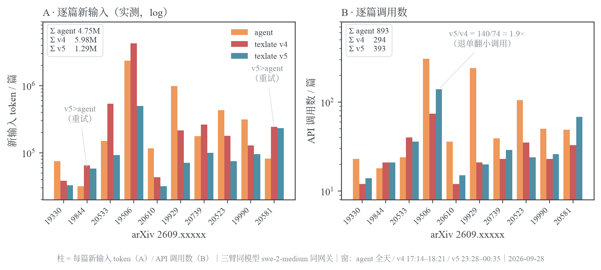
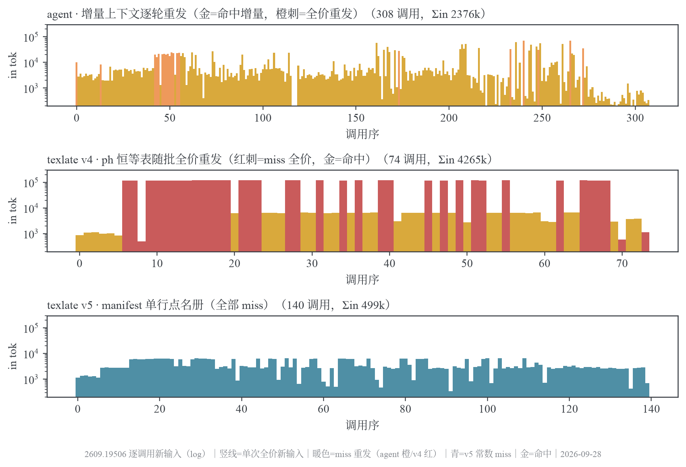
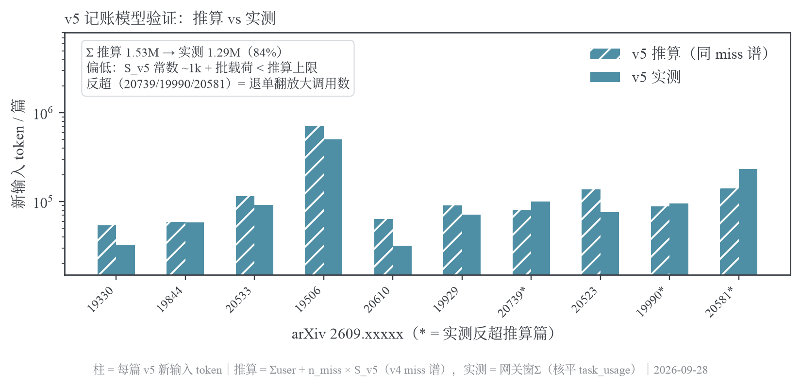
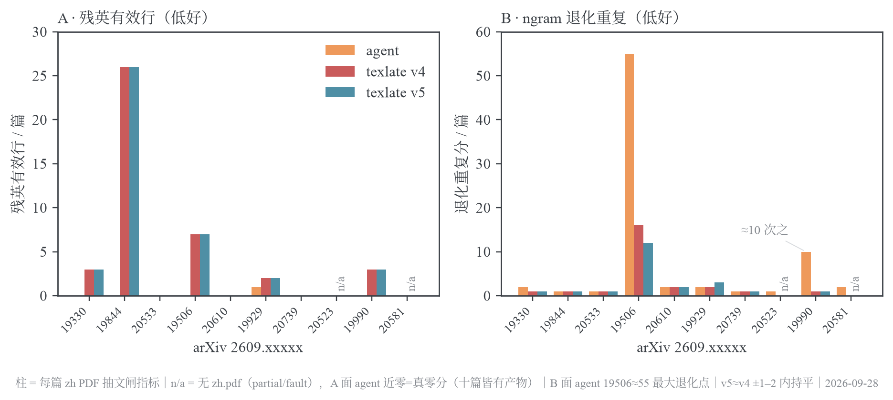

# agent 直翻 vs texlate 管线：三臂实测基线（2026-09-28/29，v4 + v5 口径）

> **结论**：v5 实测把 texlate 新输入从 v4 的 5.98M 压到 **1.29M**（−78%，优于推算的 1.53M）——比 agent（4.75M）低 73%，把「texlate 新输入反超」的 v4 合成事故彻底拆除。压舱效应集中在 ph 重头篇：19506 一篇 4.27M → 499k（−88%）、单次最大请求 121,926 → **6,553 tok**。质量面零代价：ph 占位符 id 级存活 **10/10 篇全 100%**、残英闸逐篇持平、译文体量比 0.99–1.00。新暴露项：v5 调用数 393 vs v4 294——成员级退单翻/重试把小调用烧多了约 1/3，单次 ~3k 全价、不构成病理但值得归因。
> **状态**：三臂同模型同网关实测（v4 基线 17:14–18:21 / agent 16:30–19:35 / v5 23:28–00:35，2026-09-28→29）
> **日期**：2026-09-29

三臂同模型 `swe-2-medium`、同网关、同 10 篇论文——v4 与 agent 同日同时段交错在飞，v5 为深夜对照臂（`prefer=fresh` 禁缓存复用）。本包逐篇快照：`baseline-tokens.json`（agent/v4）+ `tmp/v5-ledger.json`（v5，窗Σ与 `task_usage` 逐字节核平）。

## 1. 三臂定义与口径

| 臂             | 形态                                                                    | 执行面                                                                         | prompt 形态                                                                     |
| -------------- | ----------------------------------------------------------------------- | ------------------------------------------------------------------------------ | ------------------------------------------------------------------------------- |
| **agent**      | codex `exec` 整篇直翻：读 e-print 包 → 全文翻译 → 迭代编译修到无 error  | 隔离 `CODEX_HOME`、`danger-full-access`、`reasoning=max`，网关 `responses` API | 自由式一句：「全文译中文，公式/引用/LaTeX 结构保留，编译出 PDF 修到无 error」   |
| **texlate v4** | 产品管线：scan→chunk→批翻（`[n]` 协议）→splice→编译→precheck/L2/fixloop | server `/api/arxiv/{id}/translate` `prefer=fresh`，网关 `openai-chat` API      | `xlat-prompt-v4`：C\*/B\* 条款 + **ph→ph 恒等注入层**（doc_ph 条/次）           |
| **texlate v5** | 同上管线同参数                                                          | 同上，`xlat-prompt-v5`                                                         | v5：同条款 + **单行 manifest 点名册**（`[[H_a]]..[[H_b]]`，超 4kc 退 `TYPE×n`） |

**口径名词**（网关 `logs` 表三列）：`input_tokens` = **新输入**，本次请求真正新发的 token（未命中前缀缓存，全价计费）；`cache_read_tokens` = **缓存读**，请求与前序请求共享前缀命中的部分（折价计费）；`output_tokens` = 输出。**毛输入 = 新输入 + 缓存读**。

**「缓存」不是多轮概念**：texlate 每个翻译请求独立单轮、互不携带对话历史——但前缀缓存是**跨请求**机制：只要后一个请求的 prompt 开头与前一个逐字节一致，共享前缀即命中。texlate 批翻同一文档的全部批请求共享同一份 system prompt，天然具备可缓存前缀；agent 则每轮重发整段对话，前轮上下文字面就是后轮前缀，命中近乎完美。

**归属面**：网关行无任务 id，逐篇切窗靠「api + key_hash + 起止时刻」。v4 基线窗内 texlate 在 key `1edae…`、v5 夜跑在 key `268cd…`（= server 所持 client key 的 sha256）；两窗均与 server `task_usage.prompt_tokens`（= in+cr）逐字节核平，无污染。v5 篇 `2609.20581` 窗比 `task_usage.calls` 多 1 行——一条 429 限流拒收、零 token，不影响 token 账。

数据面：agent 侧取网关 `logs`（`api=openai-responses`，按 codex `_status.log` START→次 START 切窗）+ codex `turn.completed` 自报交叉；texlate 侧取 `task_usage`（逐任务权威）+ 网关窗（`api=openai-chat`）。质量侧为 zh PDF 抽文闸（残英/缺字/断引/退化重复）+ chunks 级 ph 存活核验。

## 2. Token 账本（三臂实测）

`in` = 新输入，`cr` = 缓存读，`out` = 输出。v5 各窗 `Σ(in+cr)` 与 `task_usage.prompt_tokens` 逐字节相等。

| 论文       | agent calls | agent in      | agent cr       | agent out   | v4 calls | v4 in         | v4 cr         | v4 out      | v5 calls | v5 in         | v5 cr      | v5 out      | v5 in/v4  |
| ---------- | ----------: | ------------: | -------------: | ----------: | -------: | ------------: | ------------: | ----------: | -------: | ------------: | ---------: | ----------: | --------: |
| 2609.19330 | 23          | 75,070        | 410,254        | 10,327      | 12       | 38,336        | 544           | 5,829       | 14       | 32,798        | 0          | 7,354       | 0.86×     |
| 2609.19844 | 18          | 31,808        | 331,337        | 10,063      | 21       | 65,213        | 4,704         | 14,981      | 21       | 58,036        | 1,536      | 11,322      | 0.89×     |
| 2609.20533 | 24          | 150,840       | 960,887        | 32,499      | 40       | 537,040       | 68,704        | 23,621      | 36       | 92,235        | 0          | 23,738      | 0.17×     |
| 2609.19506 | 308         | 2,376,040     | 8,186,139      | 307,763     | 74       | 4,265,387     | 3,572,832     | 141,026     | 140      | 499,194       | 0          | 160,985     | 0.12×     |
| 2609.20610 | 36          | 117,062       | 863,232        | 14,798      | 12       | 43,086        | 0             | 7,036       | 15       | 31,735        | 0          | 7,155       | 0.74×     |
| 2609.19929 | 241         | 987,907       | 29,416,376     | 73,093      | 21       | 215,911       | 24,576        | 16,037      | 20       | 71,374        | 3,072      | 16,124      | 0.33×     |
| 2609.20739 | 39          | 178,195       | 1,866,240      | 33,412      | 23       | 262,628       | 61,440        | 25,450      | 29       | 100,008       | 0          | 28,118      | 0.38×     |
| 2609.20523 | 105         | 434,008       | 2,712,216      | 55,393      | 35       | 179,713       | 9,216         | 31,801      | 24       | 75,526        | 1,686      | 11,639      | 0.42×     |
| 2609.19990 | 50          | 316,244       | 2,884,078      | 45,557      | 23       | 129,065       | 18,432        | 23,772      | 26       | 95,458        | 1,536      | 25,939      | 0.74×     |
| 2609.20581 | 49          | 81,698        | 2,490,831      | 29,992      | 33       | 245,338       | 9,216         | 23,225      | 68       | 232,606       | 21,504     | 28,403      | 0.95×     |
| **合计**   | **893**     | **4,748,872** | **50,121,590** | **612,897** | **294**  | **5,981,717** | **3,769,664** | **312,778** | **393**  | **1,288,970** | **29,334** | **320,777** | **0.22×** |

口径注记：

- **20581 v5 行**：终态 fault（同 v4），68 调用含 fixloop 重试与一条零 token 429——ph 轻（656）使 v4 本就不重，重试反而把 in 烧到 v4 的 95%，v5 收益被终态失败吃掉。
- **v5 调用数普遍高于 v4**（19506 最甚：140 vs 74）：同 888 chunks、同 ~44 个主批，v5 多出 ~96 个中小调用（out≤800）——`[n]` 批量协议的整批退单翻成员级重发。机理见 §4.2。
- **19506 终态升级**：v4 partial → v5 done；其余各篇终态两臂一致（20533/20739/20523 partial，20581 fault）。

### 总量对比

| 指标             | agent      | texlate v4 | texlate v5 | v5/v4 | v5/agent |
| ---------------- | ---------: | ---------: | ---------: | ----: | -------: |
| API calls        | 893        | 294        | 393        | 1.34× | 0.44×    |
| 新输入 token     | 4,748,872  | 5,981,717  | 1,288,970  | 0.22× | 0.27×    |
| cache_read token | 50,121,590 | 3,769,664  | 29,334     | 0.01× | 0.001×   |
| 毛输入（in+cr）  | 54,870,462 | 9,751,381  | 1,318,304  | 0.14× | 0.02×    |
| 输出 token       | 612,897    | 312,778    | 320,777    | 1.03× | 0.52×    |
| codex 自报毛输入 | 45,434,502 | —          | —          | —     | —        |



_图 1 · 三臂逐篇新输入（A，log）与调用数（B）——Σin：agent 4.75M / v4 5.98M / v5 1.29M。v5 把 ph 重头篇（20533/19506/20739/19929）的尖峰塌到其余篇同量级；调用数反面膨胀（§4.2 退单翻效应）。_

读法：

- **新输入** v5 低于两臂——v4 的 5.98M 里约 4.08M 是 19506 一篇 ph 表全价重发；v5 删表后该篇 499k，其中大头是 user 源文载荷本身。
- **毛输入** v5 1.32M 为 v4 的 1/7.4、agent 的 1/42——v5 几乎不依赖前缀缓存（cr 仅 29k），省的不只是计费折价面。
- **输出** 三臂 texlate 两侧持平（313k vs 321k），agent 约 2×——迭代编译修复 + 自由式行文的固有开销。

## 3. 输入结构解剖：三臂形态成因

### 3.1 agent：增量上下文模型——每轮重发全量、靠前缀缓存续命

codex agent 的每个 API 调用都重发完整对话（系统指令 + 已读文件 + 工具输出 + 已写译文），上下文随任务进展单调膨胀（19929 平台在 ~186k；262k 窗口、auto-compact 阈值 230k）。上游前缀缓存把「本轮新增」与「历史前缀」劈开：新增落新输入，历史前缀命中缓存。

2609.19330 逐调用序列（`新输入 / 缓存读`，输出略）：

```text
 0: 10245/0       首调用全量新发（无缓存）
 1:   282/10244   每轮新增仅数百~数千，历史全命中
 2:  1089/10525
 …
11: 20282/0        缓存失守事件：20k 全量重发（前缀驱逐/compaction 重启）
12:  2415/18432    缓存重建后回到增量模式
…
22:  3132/27648    长文尾部 cr 平台在 ~27.6k（本篇体量）
```

机制推论：新输入 ≈ 逐轮增量总和（893 调用 × 数百–数千 + 若干次 10–177k 全量重放）≈ 4.7M；缓存读 ≈ 历史上下文重放累计 50M——agent 方案的固有形态：整个工作记忆必须保持在上下文里。

agent 请求画像（逐篇）：`req 均长` = 毛输入/calls，`cr/in 总比` 越高说明越依赖缓存续命。

| 论文       | calls | req 均长   | 首 call in | 末段 cr 峰值 | cr/in 总比 |
| ---------- | ----: | ---------: | ---------: | -----------: | ---------: |
| 2609.19330 | 23    | 21,101     | 10,245     | 27,648       | 5          |
| 2609.19844 | 18    | 20,174     | 10,245     | 31,663       | 10         |
| 2609.20533 | 24    | 46,321     | 7,173      | 77,466       | 6          |
| 2609.19506 | 308   | 34,292     | 10,245     | 83,567       | 3          |
| 2609.19929 | 241   | 126,158    | 10,245     | 187,415      | 29         |
| 2609.20739 | 39    | 52,421     | 10,245     | 81,408       | 10         |
| 2609.20523 | 105   | 29,964     | 10,245     | 61,333       | 6          |
| 2609.19990 | 50    | 64,006     | 10,245     | 104,448      | 9          |
| 2609.20581 | 49    | 52,500     | 10,245     | 81,018       | 30         |
| 2609.20610 | 36    | 27,230     | 469        | 36,864       | 7          |
| 全体       | 893   | **61,445** | —          | —            | 10.6       |

### 3.2 texlate：单轮独立请求 + 跨请求前缀缓存抽签

API 无状态：每个请求自带完整 `system + user(本批源文)`，前缀缓存只决定这串字节按 cache_read 折价还是 input 全价记账。理想形态是「首个请求写缓存、其后全命中、新输入只剩 user」；实测是并发批（concurrency=3）下的驻留抽签——同波请求在缓存项落库前已齐发、TTL/驱逐与上游多后端轮询共同造成 miss。

**v4 把抽签做成了灾难**：ph→ph 恒等表把 doc_ph 条恒等行烙进 system（19506 达 ~115k/请求），每次 miss 全价重发。19506 的 74 调用分桶：34 次全量重发（in>50k，Σ4.08M）+ 31 次缓存命中（新输入只剩 ~5.7k user）+ 9 小调用——B/H 全程交错，~46% 全价率。

**v5 把抽签做成了无所谓**：manifest 单行（十篇实测 106–3,686 字符；ph 重头篇全走 `TYPE×n` 退化形、19506 仅 110c ≈ ~50 tok）把 system 常数压到 ~1k 量级，miss 依旧（命中率仅 5%，20/393）但每次 miss 只付 ~3k。

同篇心电图（19506，每竖线 = 一次调用的全价新输入，log 轴）：



_图 2 · 2609.19506 逐调用新输入——agent（上）金色场为增量命中常态、橙刺为全量回放事件；v4（中）红刺是 ~122k ph 表全价重发、金条是命中调用（in 只剩 user）；v5（下）140 调用全部塌平在 ~1–6.5k，无一超 7k。_

### 3.3 逐篇逐调用画像

`in_p50` = 单次调用新输入中位，`in_max` = 最大单次新输入，`cr_max` = 最大单次缓存读（≈ system 可缓存前缀规模），`hit_calls` = 有命中的调用数，`doc_ph` = 源文去重 `[[TYPE_n]]` 数，`ph表≈` = doc_ph×14 tok 估算，`req均长` = 毛输入/calls，`user中位` = 命中调用的新输入中位。

v4 臂：

| 论文       | calls | in_p50 | in_max  | cr_max  | hit_calls | doc_ph | ph 表≈  | req 均长 | user 中位 |
| ---------- | ----: | -----: | ------: | ------: | --------: | -----: | ------: | -------: | --------: |
| 2609.19330 | 12    | 3,993  | 4,876   | 272     | 2         | 112    | 1,568   | 3,240    | 925       |
| 2609.19844 | 21    | 4,045  | 4,856   | 1,536   | 8         | 50     | 700     | 3,329    | 2,952     |
| 2609.20533 | 40    | 19,040 | 22,034  | 16,896  | 10        | 1,193  | 16,702  | 15,143   | 2,162     |
| 2609.19506 | 74    | 6,703  | 121,926 | 115,200 | 37        | 7,544  | 105,616 | 105,921  | 6,408     |
| 2609.20610 | 12    | 3,740  | 5,495   | 0       | 0         | 148    | 2,072   | 3,590    | —         |
| 2609.19929 | 21    | 14,386 | 16,112  | 12,288  | 2         | 889    | 12,446  | 11,451   | 4,750     |
| 2609.20739 | 23    | 18,035 | 20,673  | 15,360  | 4         | 1,071  | 14,994  | 14,089   | 4,982     |
| 2609.20523 | 35    | 5,678  | 8,261   | 3,072   | 3         | 161    | 2,254   | 5,397    | 2,737     |
| 2609.19990 | 23    | 7,174  | 9,456   | 4,608   | 4         | 299    | 4,186   | 6,412    | 3,597     |
| 2609.20581 | 33    | 11,474 | 14,039  | 9,216   | 1         | 656    | 9,184   | 7,713    | 2,375     |

v5 臂（同窗口径；v5 无 ph 表层，`ph表≈` 列让位给 manifest 字符实测）：

| 论文       | calls | in_p50 | in_max | cr_max | hit_calls | doc_ph | manifest c | req 均长 |
| ---------- | ----: | -----: | -----: | -----: | --------: | -----: | ---------: | -------: |
| 2609.19330 | 14    | 2,565  | 3,769  | 0      | 0         | 112    | 708        | 2,343    |
| 2609.19844 | 21    | 3,467  | 4,118  | 1,536  | 1         | 50     | 271        | 2,837    |
| 2609.20533 | 36    | 2,285  | 5,195  | 0      | 0         | 1,193  | 113        | 2,562    |
| 2609.19506 | 140   | 2,906  | 6,553  | 0      | 0         | 7,544  | 110        | 3,566    |
| 2609.20610 | 15    | 1,748  | 3,639  | 0      | 0         | 148    | 440        | 2,116    |
| 2609.19929 | 20    | 3,671  | 5,705  | 1,536  | 2         | 889    | 3,210      | 3,722    |
| 2609.20739 | 29    | 3,321  | 6,726  | 0      | 0         | 1,071  | 106        | 3,448    |
| 2609.20523 | 24    | 3,404  | 4,532  | 1,536  | 2         | 161    | 1,126      | 3,217    |
| 2609.19990 | 26    | 3,639  | 5,886  | 1,536  | 1         | 299    | 1,562      | 3,730    |
| 2609.20581 | 68    | 4,070  | 6,802  | 1,536  | 14        | 656    | 3,686      | 3,737    |

读法：

- **in_max 全臂压到 ≤6.8k**（v4 峰值 121,926 → −95%）——doc 级常数从 prompt 体积里被摘除，单次 miss 只剩「~1k system + 单批 user」。
- **命中率几乎归零**（5%）：system 太小没东西可省是主因；20581 的 14 次命中是 fault 重试原样重发攒出的。
- **req 均长** v5 ~2.1–3.7k ≈ 纯批大小——这就是「理想缓存形态下 texlate 该有的样子」，只是不必再靠缓存达成。
- **manifest 与 doc_ph 解耦**：ph 重头篇 manifest 全走 `TYPE×n` 退化形（20533 113c/1193ph、19506 110c/7544ph）；稀疏编号篇走连续段枚举（20581 3,686c/656ph）。

### 3.4 新输入构成总账：虚耗从 85% 收到 ~30%

把三臂新输入各拆「有效载荷」与「重发虚耗」（v4 口径：miss = `cache_read==0`，system 常数取 cr_max 观测值；v5 口径：Σin − 同源 user 载荷≈0.90M，含调用数膨胀带来的小批量损耗）：

| 臂         | 新输入合计 | 有效载荷                 | 重发虚耗                                          | 虚耗占比 |
| ---------- | ---------: | -----------------------: | ------------------------------------------------: | -------: |
| texlate v4 | 5,981,717  | 源文 user ≈ **902,843**  | system 重发 ≈ 5,078,874（19506 一篇占 3,919,040） | **85%**  |
| agent      | 4,748,872  | 逐轮增量 ≈ **3,298,789** | 全量重发 ≈ 1,450,083（62 次 cr=0 事件/893 调用）  | 31%      |
| texlate v5 | 1,288,970  | 同源 user ≈ **0.90M**    | system+ 小批量开销 ≈ 0.39M（393 调用 × ~1k）      | **~30%** |

v5 虚耗已与 agent 同量级、远低于 v4——但结构不同：agent 的虚耗是集中式全量回放事件，v5 是「每调用 ~1k 常数 × 膨胀后的调用数」的平摊税。调用数若不膨胀（294 平移），v5 新输入理论下界 ≈ 0.9M+294×1k ≈ **1.19M**——实测 1.29M 距下界仅 8%。

## 4. v5 实测：记账模型验证与新暴露项

### 4.1 推算 vs 实测：同量级、逐篇同形、总体偏保守

§3.2 的推算方法是「v4 观测 miss 谱 × v5 常数 S」；实测普遍低于推算，Σ 推算 1.53M → **Σ 实测 1.29M（84%）**——S_v5 实际 ~1k/调用，小于常数估上限（manifest tok + 非 ph 头部 ~0.6–9.6k）。三篇反超（20739 124%、19990 108%、20581 164%）全部是调用数膨胀所致——推算按 v4 miss 调用数，实测里退单翻/重试把小调用变多了。



_图 3 · v5 记账模型验证——推算柱（斜纹）按 v4 miss 谱照搬常数项，实测柱为网关窗Σ（与 task_usage 逐字节核平）。常数项治住了；调用数膨胀是推算模型没覆盖的新变量。_

### 4.2 新暴露项：退单翻/重试放大调用数

v5 调用数 393 vs v4 294（+34%），膨胀集中：19506 +66（140 vs 74）、20581 +35（68 vs 33）。19506 两臂同为 888 chunks、~44 个主批（out>800 调用 44 vs 45）——v5 多出 ~96 个中小调用（out≤800）。单个都是 ~3k 小调用、总代价 ~0.3M——不痛，但它是 v5 超推算额的全部来源。**已归因（2026-09-29，网关账本逐请求 → member 尺寸匹配重建）**：非解析失败退单翻，而是 **~50 个 ph 密集 member（ph≈28/段 vs 语料≈10）在上游退化窗口反复撞梯级**——19506 的 17 个 member 独烧 80 次调用（单 member 最多 15 次）；75/136 归因 member 源文零 NBSP，与空白符审计无关。重建口径与 keep-roster/values 后续实验见 `../2026-09-29-keep-roster-and-values-truncation.md`。

### 4.3 时效与终态

v5 各篇 submit→terminal 普遍快于 v4（105/180/240/495/90/150/375s vs 140/241/240/600/101/180/340s）；唯二变慢的是带病重试的 20523（900 vs 821）与 20581（1230 vs 1181）。**19506 终态从 partial 升到 done**——v4 在该篇的 fixloop 预算曾被编译错误耗尽，v5 同错位没有触发同深度修复（或修复成功）——终态改善与 token 收缩同源：单次调用更小、修复循环每步更便宜。

## 5. 时效（submit→terminal，秒）

| 论文       | agent |  v4 |  v5 |     | 论文       | agent |    v4 |    v5 |
| ---------- | ----: | --: | --: | --- | ---------- | ----: | ----: | ----: |
| 2609.19330 |   185 | 140 | 105 |     | 2609.19929 | 2,808 |   180 |   150 |
| 2609.19844 |   298 | 241 | 180 |     | 2609.20739 |   366 |   340 |   375 |
| 2609.20533 |   801 | 240 | 240 |     | 2609.20523 |   863 |   821 |   900 |
| 2609.19506 | 1,613 | 600 | 495 |     | 2609.19990 |   811 |   160 |   210 |
| 2609.20610 |     — | 101 |  90 |     | 2609.20581 |   777 | 1,181 | 1,230 |

三臂同时段共享网关输出上限，绝对时长互相稀释：agent 长篇发散（19929 约 47 分），texlate 两臂时长可预期、v5 普遍更快。

## 6. 质量闸与占位符保真（zh PDF 抽文 + chunks 核验）

`resid-en eff` = 残英有效行，`EN-unreached` = 未触达英文行，`tail-cut` = 尾部英文（多为 references），`ngram-rep` = 退化重复分，`—` = 无可抽产物。

| 论文       | 终态 A/v4/v5          | resid-en eff A/v4/v5 | unreached A/v4/v5 | tail-cut A/v4/v5       | ngram A/v4/v5    |
| ---------- | --------------------- | -------------------- | ----------------- | ---------------------- | ---------------- |
| 2609.19330 | rc0 / done / done     | 0 / 3 / 3            | 0 / 1 / 1         | 470 / 637 / 647        | 2 / 1 / 1        |
| 2609.19844 | rc0 / done / done     | 0 / 26 / 26          | 0 / 0 / 0         | 469 / 842 / 794        | 1 / 1 / 1        |
| 2609.20533 | rc0 / partial/partial | 0 / 0 / 0            | 0 / 0 / 0         | 15 / 48 / 49           | 1 / 1 / 1        |
| 2609.19506 | rc0 / partial/done    | 0 / 7 / 7            | 5 / 7 / 7         | 15,008 / 16,250/16,217 | **55** / 16 / 12 |
| 2609.20610 | rc0 / done / done     | 0 / 0 / 0            | 1 / 1 / 1         | 538 / 537 / 533        | 2 / 2 / 2        |
| 2609.19929 | rc0 / done / done     | 1 / 2 / 2            | 9 / 6 / 6         | 1,702 / 1,707/1,698    | 2 / 2 / 3        |
| 2609.20739 | rc0 / partial/partial | 0 / 0 / 0            | 0 / 3 / 1         | 1,109 / 1,136/1,143    | 1 / 1 / 1        |
| 2609.20523 | rc0 / partial/partial | 0 / — / —            | 2 / — / —         | 736 / — / —            | 1 / — / —        |
| 2609.19990 | rc0 / done / done     | 0 / 3 / 3            | 4 / 38 / **16**   | — / 1,154 / 1,118      | **10** / 1 / 1   |
| 2609.20581 | rc0 / fault / fault   | 0 / — / —            | 4 / — / —         | 514 / — / —            | 2 / — / —        |



_图 4 · 三臂质量闸——残英有效行（A）与 ngram 退化分（B），n/a = 无 zh.pdf 产物。v5≈v4 全项持平（覆盖指标见上表：19990 unreached 38→16）；agent 19506 ngram≈55 为三臂最大退化点（19990≈10 次之）。_

**占位符保真（v5 特有疑虑的裁决）**：manifest 名单行化后 ph id 不再逐条出现在 system——丢锚/串号核验：**10/10 篇 id 级存活率全 100%**（含 19506 的 7,544 个 ph 走 `TYPE×n` 退化形）、译文臆造 id 数全 0。同批下 `src_occ == tr_occ` 逐篇相等（如 19990:337↔337）。

**译文体量**：v4↔v5 逐篇 `Σ|translation|` 比 0.989–1.003——行文密度完全平行，无截断或注水漂移。

读法：

- **交付率**：agent 全产出 PDF；texlate 两臂终态分布 5done/4partial/1fault（v4）→ 6/3/1（v5），partial/fault 篇无 zh.pdf 可抽（—）。
- **已交付残英**：texlate 两臂逐篇持平；19990 的 unreached 行 v5 从 38 降到 16。agent 侧 eff 全线 ≤1，但 19506 `ngram-rep=55`、19990 `=10` 提示长文行文退化风险。
- **缺字/断引/FFFD**：三臂全零——底层文本完整性同水平；tail-cut 三臂同量级，系 references 保留倾向。

## 7. 裁决

1. **token 经济性**：v5 实测新输入 1.29M = v4 的 22%、agent 的 27%；毛输入 1.32M = agent 的 2.4%——texlate 的「分段批翻 + 无状态单轮 + 小常数 system」在三臂中已是最省形态，且几乎不再消耗前缀缓存额度。
2. **v4 病理确诊并治愈**：ph→ph 恒等注入（doc 级常数烙进每请求）曾是 texlate 新输入反超的唯一机制（19506 占 95.6%、全臂虚耗 85%）；v5 manifest 单行把它摘除后，同篇 4.27M → 499k、in_max 122k → 6.5k，推算模型（载荷+miss×常数）验证成立（实测为推算的 84%）。
3. **新暴露项是调用数而非体积**：v5 393 calls vs v4 294——成员级梯级重试在 v5 下更频繁（19506 多 ~66 个小调用）。全是最低价的小调用，但吃掉推算与实测间的差额；已归因为 ph 密集 member 在上游退化窗口的重试风暴（见 §4.2 与 2026-09-29 后续实验）。
4. **正确率/质量零代价**：ph id 级存活 10/10 全 100%、臆造 0、残英闸逐篇持平、译文体量比 0.99–1.00；终态还净赚一篇（19506 partial→done）。v5 是纯赚的一刀。
5. **交付保证**：agent 必出 PDF 但时长/输出通胀、长文有 ngram 退化；texlate 有 partial/fault 终态但已交付部分闸值干净，且 prompt 轻量化不再以保真换省钱。

## 8. 数据源与复算

| 件                 | 口径                                                                                                                                                               |
| ------------------ | ------------------------------------------------------------------------------------------------------------------------------------------------------------------ |
| 网关逐请求账本     | devin-2api `logs` 表：`input_tokens`/`cache_read_tokens`/`output_tokens`/`api`/`key_hash`/毫秒 `time`                                                              |
| texlate 逐任务用量 | server store `task_usage` 表：`prompt_tokens`（= 网关 in+cr）/`completion_tokens`/`calls`/`latency_s`                                                              |
| agent 事件流       | codex `exec --json` 逐篇日志，`turn.completed.usage` 自报                                                                                                          |
| 质量闸             | zh PDF 抽文扫描件（残英/缺字/断引/退化规则闸）+ `tmp/qc_results_v5.json`                                                                                           |
| ph 存活            | `tmp/ph_survival.py`——chunks.src_text vs translation 的 `[[TYPE_n]]` id 集合差分（v4/v5 同篇配对）                                                                 |
| 逐篇快照           | `baseline-tokens.json`（agent/v4，`tools/arms_tokens.py` 生成）+ `tmp/v5-ledger.json`（v5）                                                                        |
| v5 窗口            | `tmp/v5-arm-wins.json`（driver `tmp/v5_arm_driver.py` 顺序提交产物，epoch 起止 + task_id）                                                                         |
| 图 1–4 生成脚本    | `tmp/fig_three_arms.py`（scratch；输入件均为本文数据面，可复算）                                                                                                   |
| 图表 VLM 评审底档  | `charts/` 下 `arms-input-tokens.vlm-judge.md`、`arms-request-ekg.vlm-judge.md`、`arms-v5-validation.vlm-judge.md`、`arms-quality.vlm-judge.md`，与四张主图一一对应 |
