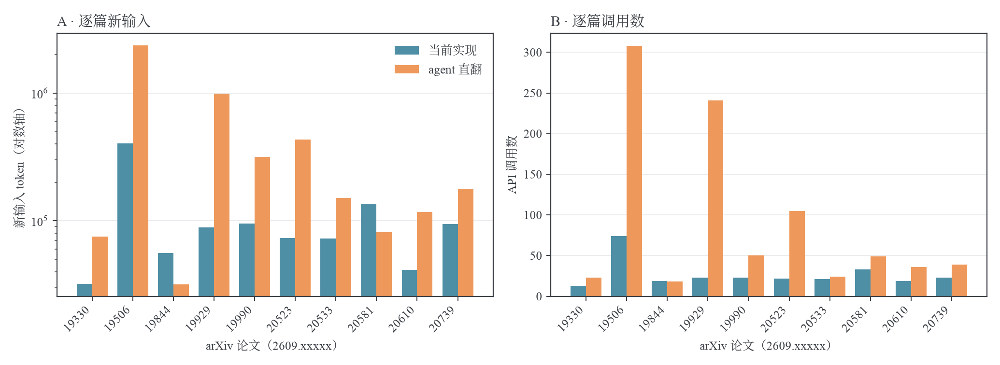
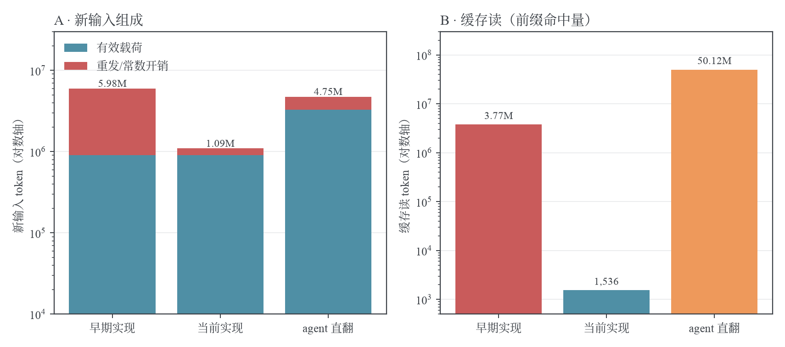
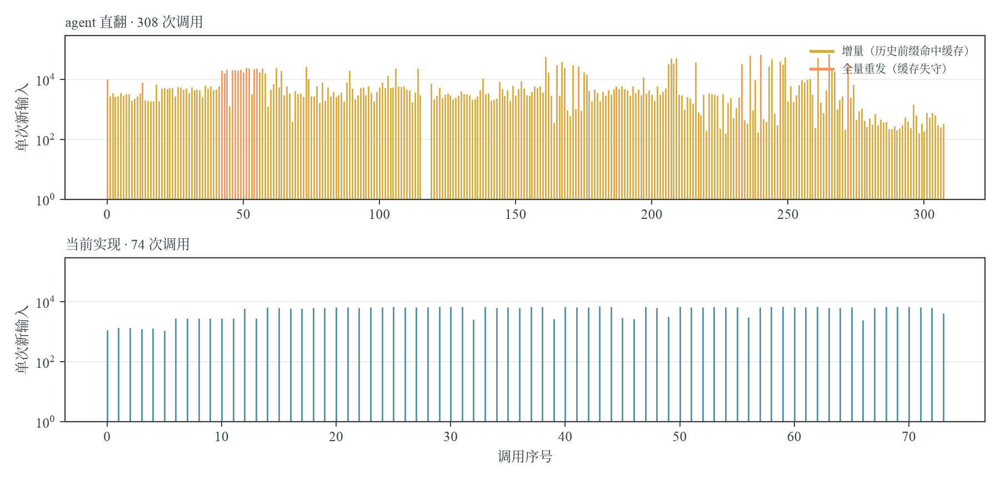

# token 用量解剖：管线与 agent 整篇直翻的三方实测（2026-10-03）

> **结论**：同 10 篇论文、同模型（swe-2-medium）、同网关逐请求账本实测——当前管线新输入 **1.09M token，为 agent 整篇直翻（4.75M）的 23%**；含缓存读的总输入 1.10M，为 agent（54.87M）的 **2.0%**；输出 295k 为 agent 的 48%；调用 270 次为 agent 的 30%。成本结构上两者不在同一量级：agent 的用量随上下文单调膨胀、靠前缀缓存续命；管线每个请求无状态、单次最大新输入 7,689 token，几乎不消耗缓存额度。
> **状态**：时点证据（agent 与早期实现测于 2026-09-28，当前实现复测于 2026-10-02；逐篇窗口与 server `task_usage` 逐字节核平）
> **日期**：2026-10-03

## 1. 测量设计

三方同题对照：10 篇 2026-09 arXiv 新论文（原始样本集，逐篇明细见 `data/per-paper-tokens.json`），同一模型经同一网关结算，token 三列全部取网关逐请求账本而非各方自报。

| 方         | 形态                                                                     | prompt 形态                                                                |
| ---------- | ------------------------------------------------------------------------ | -------------------------------------------------------------------------- |
| agent 直翻 | codex `exec`：读 e-print 源码包 → 全文翻译 → 迭代编译修到无 error        | 一句自由指令（「全文译中文，公式/引用/LaTeX 结构保留，编译修到无 error」） |
| 当前实现   | texlate 管线：分段批翻、无状态单轮请求、占位符点名册单行                 | 条款化 system（角色 + 任务 + 编号规则区 + glossary 尾块）                  |
| 早期实现   | 同一管线 2026-09-28 前的形态：system 内嵌逐条 `[[X_n]] → [[X_n]]` 恒等表 | 同上 + doc 级恒等表（占位符数 × ~14 token/行）                             |

早期实现不是参评对象，是组成分析的对照物——它精确演示了「不该重发什么」。

**口径**：网关 `logs` 表三列。`input_tokens` = 新输入，本次请求未命中前缀缓存、按全价计费的部分；`cache_read_tokens` = 缓存读，与前序请求共享前缀命中的折价部分；`output_tokens` = 输出。总输入 = 新输入 + 缓存读。

前缀缓存是跨请求机制：两方的利用方式相反——agent 每轮必须重发全部对话历史，缓存命中是它唯一可行的活法（命中率近乎完美是设计使然，不是优化成果）；管线各请求相互独立，同篇全部批请求共享同一份 system，命中是抽签式的便宜，不命中也无碍。

## 2. 总量账

| 指标         | agent 直翻 | 早期实现  | 当前实现  | 当前/agent |
| ------------ | ---------: | --------: | --------: | ---------: |
| API 调用     | 893        | 294       | 270       | 0.30×      |
| 新输入 token | 4,748,872  | 5,981,717 | 1,094,448 | **0.23×**  |
| 缓存读 token | 50,121,590 | 3,769,664 | 1,536     | 0.00003×   |
| 总输入       | 54,870,462 | 9,751,381 | 1,095,984 | **0.020×** |
| 输出 token   | 612,897    | 312,778   | 294,672   | 0.48×      |

逐篇新输入与调用数：

| 论文       | agent 调用 | agent 新输入  | agent 缓存读   | 早期新输入    | 当前调用 | 当前新输入    | 当前/agent |
| ---------- | ---------: | ------------: | -------------: | ------------: | -------: | ------------: | ---------: |
| 2609.19330 | 23         | 75,070        | 410,254        | 38,336        | 13       | 32,177        | 0.43×      |
| 2609.19506 | 308        | 2,376,040     | 8,186,139      | 4,265,387     | 74       | 404,904       | **0.17×**  |
| 2609.19844 | 18         | 31,808        | 331,337        | 65,213        | 19       | 55,971        | 1.76×      |
| 2609.19929 | 241        | 987,907       | 29,416,376     | 215,911       | 23       | 88,678        | **0.09×**  |
| 2609.19990 | 50         | 316,244       | 2,884,078      | 129,065       | 23       | 95,100        | 0.30×      |
| 2609.20523 | 105        | 434,008       | 2,712,216      | 179,713       | 22       | 73,559        | 0.17×      |
| 2609.20533 | 24         | 150,840       | 960,887        | 537,040       | 21       | 72,727        | 0.48×      |
| 2609.20581 | 49         | 81,698        | 2,490,831      | 245,338       | 33       | 135,669       | 1.66×      |
| 2609.20610 | 36         | 117,062       | 863,232        | 43,086        | 19       | 41,432        | 0.35×      |
| 2609.20739 | 39         | 178,195       | 1,866,240      | 262,628       | 23       | 94,231        | 0.53×      |
| **合计**   | **893**    | **4,748,872** | **50,121,590** | **5,981,717** | **270**  | **1,094,448** | **0.23×**  |



_图 1 · A：逐篇新输入（对数轴）——当前实现在 8/10 篇低于 agent，占位符重头篇差距最大（19929:0.09×）。B：逐篇调用数——agent 调用随任务迭代次数发散（19506 三百余次），管线调用数由批数决定、可预期。_

两篇反超要如实记账：19844 是小论文，agent 把全文读进上下文一次即够、管线逐批付 ~0.7k 常数，小篇上常数项摊不薄；20581 是终态 fault 篇，重试把新输入烧到 agent 的 1.66 倍。两篇合计多烧 ~7.8 万 token，不改变总量格局。

## 3. 输入组成

### 3.1 agent：上下文全量随行

agent 的每次 API 调用都重发完整对话：系统指令与工具定义（首调用 10,245 token）+ 已读文件 + 工具输出 + 已写译文，上下文随任务单调膨胀——19929 的平台期已达 ~186k/调用，逼近 auto-compact 阈值。新输入因此劈成两块：

- **逐轮增量 3,298,789（69%）**：每轮新增的文件读入、编译日志、工具回显。这是工作记忆的增量账，不可避免但随轮数线性累。
- **全量重发 1,450,083（31%）**：缓存失守（前缀驱逐、上下文压缩重启）时整段历史全价重发。893 次调用中 62 次命中此事件，单次最大 70,776（19506）。

与之对称的另一面是 50.1M 缓存读——整个工作记忆每轮重放一遍、按折价记账。19506 末段单次缓存读峰值 83,567，19929 达 187,415。这个结构的前提是供应商提供前缀缓存；在没有缓存的部署面上，agent 的总输入 54.87M 全额计费，是管线的 50 倍。

### 3.2 当前管线：无状态单轮

每个请求 = system（~0.7–1k）+ user（本批源文）。互不带历史，互不依赖缓存——10 篇全程缓存读仅 1,536 token。组成两块：

- **源文载荷 ≈902,843（82%）**：分批发出的待译正文。报文形态（成员行内嵌 `keep:` 名单点名该成员须保真的占位符集）：

```text
[37] keep: [[CITE_14]] [[CITE_15]] | Pe\~nafiel-Tom\'as and Peralta-Salas [[CITE_14]] and can be used to reprove [[CITE_15]] of Giri and Radu without a Newton iteration.
```

- **调用常数 ≈191,605（18%）**：270 次调用 × 实测均 ~0.7k 的 system。system 末行的占位符点名册是 doc 级唯一注入点，渲染分三档——编号稀疏时逐条枚举、连号段压缩成 `[[X_a]]..[[X_b]]` 区间、行超 4,000 字符退化为无括号计数形（防回抄触发重翻）。两行均为函数真实输出：

```text
- placeholders used in this document (preserve each verbatim): [[CITE_1]]..[[CITE_3]], [[MATH_1]]..[[MATH_12]], [[NBSP]], [[REF_2]], [[SL]]
- placeholders used in this document (preserve each verbatim): CITE×167, MATH×429
```

占位符重头篇全落在计数形——19506 的 7,544 个占位符实测只占 110 字符 ≈ 50 token。

重试路径同样是小调用：成员级退单翻只重发单个 `[n]` 成员（~1–3k），带错重翻走 corrector 三段式（原文/现译/错误报告），都不触碰 doc 级数据。

### 3.3 早期实现：恒等表把 doc 级常数烙进每次请求

早期实现在 system 里逐条列出全篇占位符的恒等映射（`[[MATH_12]] → [[MATH_12]]`，7,544 个占位符的 19506 即 ~105k/请求），指望模型照表保真。效果是每次缓存未命中都全价重发这张表：19506 的 74 次调用里 34 次单发 >50k，合计 4.08M——一篇烧掉全测试集新输入的 68%。恒等表（~98% 体积是纯重发）是当前实现用单行点名册替换掉的东西；占位符保真责任从「每请求重申全表」移到了「批成员行内嵌 keep 名单 + 译后逐条校验」。

### 3.4 组成总账

| 方       | 新输入    | 有效载荷            | 重发/常数开销                    | 开销占比 |
| -------- | --------: | ------------------: | -------------------------------: | -------: |
| 早期实现 | 5,981,717 | 源文 ≈902,843       | 恒等表重发 ≈5,078,874            | **85%**  |
| 当前实现 | 1,094,448 | 同源文 ≈902,843     | 调用常数 ≈191,605（270 × ~0.7k） | 18%      |
| agent    | 4,748,872 | 逐轮增量 ≈3,298,789 | 全量重发 ≈1,450,083              | 31%      |



_图 2 · A：新输入组成——管线的开销是平摊小常数，agent 的开销是集中式全量回放事件，早期实现是逐请求恒等表税。B：缓存读——agent 靠 50M 折价重放维持上下文，当前实现全程 1.5k。_

## 4. 逐调用解剖：占位符重头篇 2609.19506

取占位符最密集的 19506（去重占位符 7,544 个、888 段），三方逐调用新输入：



_图 3 · 每竖线 = 一次调用的新输入 token（对数轴）。agent（上）：金色增量常态 + 橙色 23 次全量回放（Σ544k，单次最大 70.8k）。早期实现（中）：红色 34 次恒等表全价重发（Σ4.08M，单次 ~122k）与金色缓存命中交错——同样 50% 命中率，代价完全取决于 system 里烙了什么。当前实现（下）：74 次调用塌平在 1.1k–7.1k，全部未命中缓存也无妨。_

同一张图说明三件事：agent 的费用形态由轮数与上下文长度决定，不受控；早期实现的费用由缓存抽签决定，不可控；当前实现的费用由源文长度决定，逐篇可预算。

## 5. 输出侧

agent 612,897 vs 管线 294,672（0.48×）。结构差异：agent 输出含整份 .tex 的反复重写（未译的 LaTeX 骨架也逐字重发）与编译修复迭代的每次重 emit；管线输出只有译文文本加 `[n]` 编号壳，输出/新输入比 27%（agent 13%）。逐篇 agent 输出均不低于管线，唯二例外是 19844（小篇，管线带错重翻多烧 1.3k）与 20581（fault 篇重试）。

## 6. 生产规模交叉验证

10 篇样本含 19506 这种极端重头篇，均摊 109k 新输入/篇偏高；样本中位 81k。生产面两个 200 篇测试集的总账给出更低单篇均摊：通用集 59k 新输入 / 15k 输出每篇，新 CS 集 47k / 12k——新 CS 论文篇幅更短、占位符更稀。按 swe-2-medium 计费面折算，生产单篇翻译成本约 0.17 美元。

## 7. 质量对照

省 token 没有用质量换：占位符 id 级存活 10/10 篇全 100%（含 19506 的 7,544 个占位符走计数形点名册），臆造占位符 0；残英闸与早期实现逐篇持平；译文体量比 0.99–1.00。agent 侧两篇长文出现行文退化（19506 ngram 重复分 55，为三方最大值）——全量上下文模型的长文通病。终态面：管线 7 done / 2 partial / 1 fault，agent 全部产出 PDF 但时长与输出同步通胀（19929 单篇 47 分钟）。

## 8. 口径与复算

| 件                           | 内容                                                                                |
| ---------------------------- | ----------------------------------------------------------------------------------- |
| `data/per-paper-tokens.json` | 逐篇三方账：agent/早期实现取 2026-09-28 基线包实测，当前实现取 2026-10-02 复测窗    |
| `data/ekg-19506.json`        | 2609.19506 逐调用 [新输入，缓存读，输出] 行；当前实现 74 行直取网关账本窗并核平总额 |
| `make_figs.py`               | 图 1–3 再生：`uv run --with matplotlib python make_figs.py`                         |

逐篇归属口径：网关行无任务 id，按「api + key_hash + 起止时刻」切窗；当前实现各窗 Σ(新输入 + 缓存读) 与 `task_usage.prompt_tokens` 逐字节相等（10/10 篇），agent 侧另有 codex 自报 `turn.completed.usage` 交叉（自报 45.4M < 网关 54.9M，差在工具注入与上下文压缩重放，账以网关为准）。完整测量细节与质量闸底表见 [三臂实测基线](../agent-pipeline-baseline-2026-09-28/README.md)；本文是同一数据的组成视角单述。
