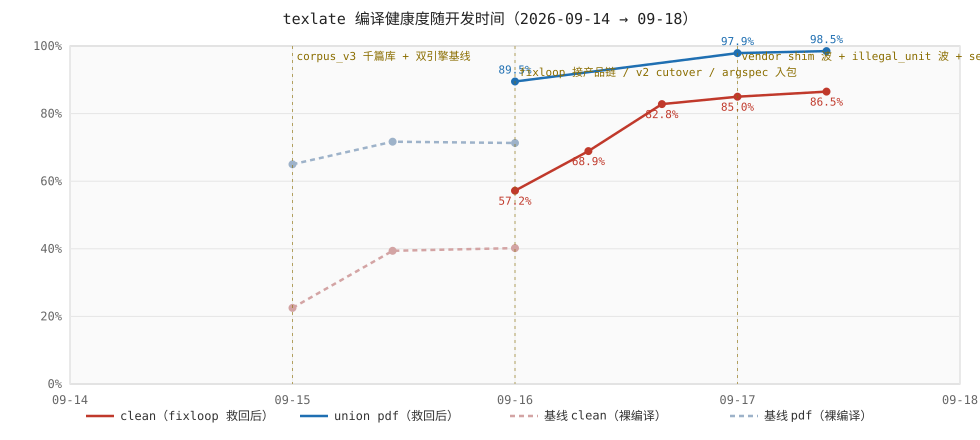
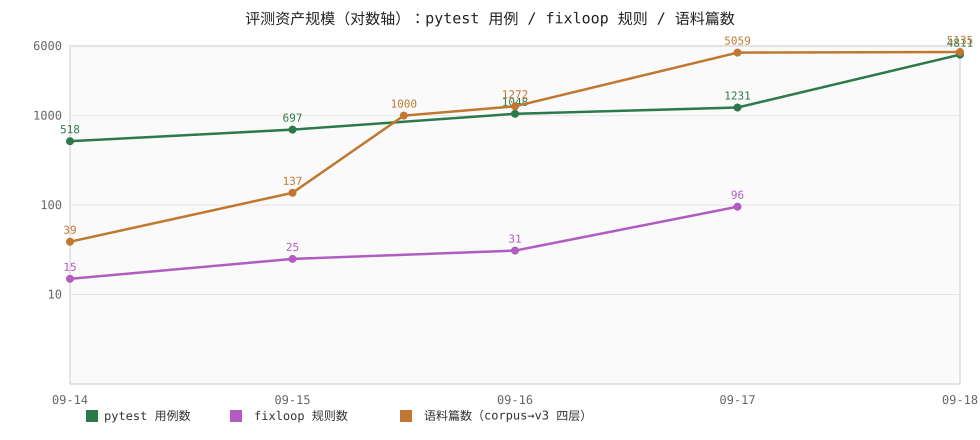

# 开发指标复盘与优化空间评估 — 2026-09-18

> 发布整理后的全面复盘：指标演化史 + 归因 + 剩余优化空间（LaTeX/翻译）+ bench 扩展裁决 + 路线图更新。数字口径：compile/scorecard 取自 `bench/results/` 各波记录与 `docs/research/report-2026-09-17-final.md` 终报；规模数取自 git 历史采样。在飞车道（_SIG_DIFFS G1/G2、o2-grp-surface 等）按 09-18 时点状态标注。

## 1. 指标演化全景

### 1.1 主图：编译健康度随时间

三条叙事线清晰可见：

1. **基线天花板很低**：裸编译（无 fixloop）union pdf 在 65–72% 之间饱和，clean 仅 22–40%——arXiv 真实语料的源级烂（missing_file 占 base fail 92.1%）决定了裸引擎撑死七成。
2. **fixloop 是单一最大杠杆**：09-16 接产品链后 union pdf 立刻 +18.9pt（70.6→89.5，同 n180 口径）；scorecard 口径一路 89.17→95.99→97.35→**97.89%**，clean 57.20→68.91→82.76→**84.99%**。救回前后两线的开口（图里红蓝实线与虚线间的高差）就是修复引擎的全部价值。
3. **09-17 波次战把残面打成个位数**：vendor shim 波把 492 格全 fail 面翻到 73.2% clean；illegal_unit 波 108/108 闭环；realn200 真臂验收 union pdf 98.5%、end clean 86.5%——real 与 mock 打平，证明评测面不是 mock 虚高。

未达标只剩一处字面：M2 出口门 clean≥90%（现 84.99%，差 ~5pt）；union pdf≥90% 门已 97.89% 大幅越过。

### 1.2 解析侧（另一条战线）

parse 面四天稳态：**identity 100% 守住，leak 0.09%→0.040%**（corpus_v3 3937 文件口径，57 条残留清一色 `dollar` 族——`$` 跨 chunk 边界失配单类债）。v2 Gullet+Segmenter cutover（`f461683`）当日把 splice 残留占位符 1524→0 清零；argspec.json 入包闭合审计期 1820 条零装载 GAP。性能侧 perf-tail 五修让 latex 长尾 −48%（total 51476→26723ms），ReDoS 修复顺带把 pytest 全量从 48min 卡死打到 3:46。

### 1.3 归因表：哪些改动搬动了哪些指标

| 日期     | 改动                                          | 指标位移                                                        |
| -------- | --------------------------------------------- | --------------------------------------------------------------- |
| 09-15    | corpus_v3 千篇分层库 + 双引擎基线测量         | 基线口径建立（pdf 71.7%/clean 39.4%，n180）                     |
| 09-16    | fixloop 接线 e2e+worker 两臂（`3d5de8f`）     | union pdf 70.6→89.5%（+18.9pt，n180 同口径复跑）                |
| 09-16    | v2 Gullet+Segmenter 默认切换（`f461683`）     | splice 残留占位符 1524→0（cutover 硬门）                        |
| 09-16    | argspec.json 入包（`401e9bb`）                | 1820 条宏参规格零装载 GAP 闭合                                  |
| 09-16    | perf-tail 五修（墓标/事件钟/cover_text）      | latex parse 长尾 −48%，identity digest 全等零回退               |
| 09-17    | vendored_fetch + vendor 23 件（`a90978a` 等） | 绝版宏包缺件面 492 格 fail→73.2% clean，scorecard clean +101 格 |
| 09-17    | illegal_unit 段修波（`d2c377b`/`1bbc4fb`）    | 108/108 闭环零回归，clean 84.76→85.03%                          |
| 09-17    | ReDoS 原子组修复（`746237f`）                 | held6 卡死 30min+→<0.1s；pytest 全量 48min→3:46                 |
| 09-17    | xlat batch 非锚定错配撤除（`164a9e0`，P0）    | 译文静默错配通道封死，同批核销 4 P1                             |
| 09-17→18 | segmenter gen=0 batch 快道（`eda6b58`）       | parse 提速（perf 链末段）                                       |

### 1.4 评测资产规模

三线齐涨：pytest 518→**4,811 用例**、fixloop 规则 15→**96 条**（16 分片）、语料 39→**5,135 篇**（corpus39 手挑陷阱 → v2 分层随机 139 → v3 四层 core1000+booster200+expand3800+hot135，frame.parquet 宇宙 3.16M 行）。机制台账 mechanisms.jsonl 144 条。

## 2. LaTeX 侧剩余优化空间（按预期收益排序）

| 收益            | 难度    | 事项                                                                                                                                                               | 出处                            |
| --------------- | ------- | ------------------------------------------------------------------------------------------------------------------------------------------------------------------ | ------------------------------- |
| leak 0.040%→~0  | 中      | **dollar 族收口**：57/57 残留 leak 全是 `$` 跨边界失配（`\$` 转义、`$L_t:=\det…$` 切段、散文裸 `$`），与 unpaired_dollar 172 条告警同源——收掉这一类 leak 归零      | `scanner.py:460 _on_dollar`     |
| clean +~3pt     | 中      | **管线引入回归 6 篇逐篇归因**：realn200 里 pipe-xel fail 而 base-xel clean（0806.2915/0905.1119/1306.0099/1706.00183/1803.00181/2308.04246）                       | realn200 matrix                 |
| pipe-fix 救回率 | 低 - 中 | missing_file×23 占 first_error 大头——`vendor/stubs/` 扩面或 tlmgr usertree 预装热包                                                                                | fixloop records                 |
| 散文召回        | 中      | `_handle_unknown_cs`/`_handle_argspec_cs` 的 `[[CMD]]` 探针臂同型蒸发（1803.00127 `\@maketitle{prose}`）——复用已落的 `_opaque_arg_prose` 判据；cat9 主面已闭勿重复 | `args.py:1177`                  |
| _SIG_DIFFS 清账 | 中      | 198 条里 104 条裁等价 +12 留档，真召回损剩 G1 protect-block 26 + G2 CHUNK_ARG 19（o2-grp-surface 在飞，落地后 mirror 应转零分歧口径）                              | `test_dispatch_mirror.py:333`   |
| \global 写透    | 低      | `\global\catcode` 类保守回吐是已裁决方向，遇真构造才亏，挂长尾                                                                                                     | `mouth.py:153`、`defcmd.py:126` |
| 口径单源化      | 低      | engine/fixloop logparse/l2 三份红线语义各写各——不亏指标但误诊浪费 fixloop 轮次                                                                                     | validate-audit                  |
| 性能            | 观察    | gen=0 batch 刚落、env.py:577/scanner.py:700 重扫已改直答；暂无新热点证据，等下一波 profile 再立项                                                                  | —                               |

## 3. 翻译侧剩余优化空间（按预期收益排序）

| 收益           | 难度 | 事项                                                                                                                                                      | 出处              |
| -------------- | ---- | --------------------------------------------------------------------------------------------------------------------------------------------------------- | ----------------- |
| **先立靶子**   | 低   | qualbench LLM-judge 停在 n=3 冒烟——「优化翻译」目前没有质量分布基线；1300 对复评跑起来，拿 swe-2-medium 的 per-kind/per-paper 分布                        | qualbench report  |
| 质量最便宜一刀 | 低   | **术语表领域扩面**：6 csv ~1790 条只盖 cs.AI/CV/LG/ML/RO+default，corpus_v3 大量 physics/math/cond-mat 稿全落 default 兜底——加表零代码（index.yaml 映射） | `xlat/terms/`     |
| 成本杠杆       | 低   | `BATCH_MAX_CHARS=2000` 保守——cost-model 实测 prompt 摊销占输入 68%，按 token 口径放宽到 ~8000ch 直接省摊销                                                | `batch.py`        |
| 差异化能力     | 中   | **全文级术语一致性**：judge 只看单 chunk，同稿术语漂移只能事后兜——首轮高频映射回填后续批次的 glossary block（hjfy 都没有的能力）                          | glossary/pipeline |
| 质量闭环       | 中   | judge<3 的 chunk 自动换 swe-2-high 重翻（matrix 实测 high 100% vs medium 97%）——hjfy「可读性差→DeepSeek 重翻」的对等物，即 roadmap M8                     | xlatbench matrix  |
| 鲁棒增量       | 低   | EN 残留率 >X% 进 L2 重翻红线——untranslated_spans 主因是缩写/专名，en_residue 免费信号已能圈                                                               | `repair_l2.py`    |
| 战略           | —    | 模型备胎面：swe-2-medium promo **2026-10-16 到期**，glm-5-2/swe-1-7-medium 已实测 96% 可兜底                                                              | xlatbench matrix  |

口径注记：`a08dda3`（translate_tree 收敛四门）之后的体积类指标才是干净口径；realn200 的 99.69% chunk ok 率含 support 件虚高。

## 4. bench 评估：要不要继续扩

**结论：不建议继续横向扩库——已入长尾。推荐序：real 探针（死线）→ 纵深分辨率 → 定点扩盲区。**

现状覆盖：B1–B7 + stagerun 五 stage + triage/dossier/scorecard 工具链全在；5,124 格 scorecard pdf 97.89%/clean 84.99% GATE PASS。

- **横扩（→10k/50k）边际已塌**：expand +3800 主要确认已知机制，09-17 各 scout 波新签名密度 ≈1 条/波且都是单篇小族（`\bffam`、jpsj3、CJK 域泄漏）。bulk 通道（IA tar）无瓶颈但扩量碰不到真盲区——pdf_only ~5% 与 f 带（2026+，242k 行）在抽样框外。50k 还需先立磁盘纪律（余 363G，原始 blob ~185G）。
- **纵深三件**（信息/工时比最高）：① `first_error→taxonomy` 物化进 records——分类器已存在只差导出，可塌掉待人工面大半；② mech_tags 全层回填把「改规则→跑覆盖格」闭环从 booster-200 扩到全 5,133；③ base 臂已收线（5,122 格，`97d30b0`）——base clean 59.8%/fail 17.3%（missing_file 占 92.1%=源级烂），**管线引入致命伤仅 0.065%**。
- **real 臂是唯一死线项**：swe-2-medium promo 2026-10-16 到期（~28 天），免费额度 40–72 格/h。realn200 已实证 mock/real union pdf 同为 98.5%——故 real 只需**滚动探针**（每波分层 200–300，hot/expand 加权）不必全量；rt1 批（在跑）即第一棒。
- **定点扩才值得**：hot 层补齐 135→160、f 带试点抽样、pdf_only 处置裁决——有明确盲区再扩，不为冲量扩。

## 5. 路线图更新（2026-09-18 裁决）

**不做**：M1 共享缓存分发层（公共 registry）——明确否决；Electron 客户端——不做。

**可做池**（建议排序，受死线与杠杆驱动）：

1. **S4 BYOK 并发裁决**（待用户）：server concurrency 3→10 是现成 ~3× 旋钮（网关翻译占单篇墙钟 96.8%，conc3 ~260s/篇 vs 管线 conc10 ~78s），限流语义是产品裁决不是技术问题。
2. **real 臂滚动探针排产**（S1，死线 10-16）：rt1 批收线后固化成 cron 式波次。
3. **§3 质量线**：qualbench 基线 → 术语表领域扩面（M7 前哨）→ 全文级术语一致性 → judge 低分重翻（M8 前哨）。
4. **§2 攻坚线**：dollar 族收口（leak 归零）→ 6 篇管线回归归因 → _SIG_DIFFS G1/G2 落地核实。
5. **M2 批量承载底板**：tasks 分页/SSE>6 收敛/GC/LRU——用户面排队体验。
6. **M3 公网分发收口**：默认 base_url 中性化、公共实例形态决策——决定「别人能不能开箱即用」。
7. 其余台账项：B3 INPUT 族单源化裁决、defect-ledger P1×~14 清账、metrics.taxonomy 物化（I5 半接）、stagerun `--post l2`/IA 拉取 stub（bench 层）。

## 6. 发布判断

**现在可发**。独立审查零硬阻塞：打包元数据齐（`uv build` 可出包、sdist 白名单挡掉 bench/results）、README quickstart 全公开依赖、CI 全公开源、LICENSE/NOTICE 完备。唯一硬前置是**轮换网关 key 240127 或 squash 历史**（树内已清零，历史仍有）。建议顺手补 `[project.urls]`/CONTRIBUTING（AGENTS.md 工具链段可直接抽出）。

上面 §1 的数字本身已足够支撑发布叙事：97.89% pdf / 84.99% clean @ 5,124 格、leak 0.040%、管线引入致命伤 0.065%——是「真打过仗」的指标，不是 demo 数。
